# omg Plugin Architecture

Comprehensive architecture documentation for the omg Copilot CLI Plugin.
Covers the plugin structure, agent orchestration model, tool access architecture,
delegation patterns, and the relationship to the omg build pipeline.

---

## 1. High-Level Overview

The omg plugin delivers OMC's multi-agent orchestration to GitHub Copilot CLI.
The pipeline compiles OMC source material into Copilot-native format.

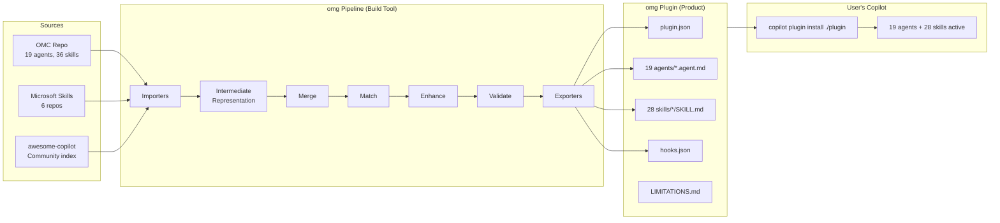

## 2. Plugin Structure

```
plugin/
├── plugin.json                          ← Manifest: name, version, paths
├── ARCHITECTURE.md                      ← This file
├── LIMITATIONS.md                       ← Known gaps + "improve when" triggers
├── hooks.json                           ← Lifecycle hooks (currently empty)
├── agents/                              ← 19 specialized agents
│   ├── executor.agent.md                ← sonnet, FULL tools
│   ├── debugger.agent.md                ← sonnet, FULL tools
│   ├── verifier.agent.md                ← sonnet, verification
│   ├── architect.agent.md               ← opus, READ-ONLY
│   ├── critic.agent.md                  ← opus, READ-ONLY
│   ├── planner.agent.md                 ← opus, planning
│   ├── analyst.agent.md                 ← opus, READ-ONLY
│   ├── explore.agent.md                 ← haiku, READ-ONLY, fast
│   ├── code-reviewer.agent.md           ← opus, READ-ONLY
│   ├── security-reviewer.agent.md       ← opus, READ-ONLY
│   ├── writer.agent.md                  ← haiku, docs
│   ├── git-master.agent.md              ← sonnet, git ops
│   ├── test-engineer.agent.md           ← sonnet, TDD
│   ├── designer.agent.md               ← sonnet, UI/UX
│   ├── document-specialist.agent.md     ← sonnet, external docs
│   ├── code-simplifier.agent.md         ← opus, refactoring
│   ├── qa-tester.agent.md               ← sonnet, interactive testing
│   ├── scientist.agent.md               ← sonnet, data analysis
│   └── tracer.agent.md                  ← sonnet, causal tracing
└── skills/                              ← 28 workflow skills
    ├── autopilot/SKILL.md               ← Full autonomous lifecycle
    ├── ralph/SKILL.md                   ← Persistent execution + verification
    ├── team/SKILL.md                    ← Parallel multi-agent coordination
    ├── ultrawork/SKILL.md               ← Parallel execution engine
    ├── plan/SKILL.md                    ← Strategic planning + consensus
    ├── ralplan/SKILL.md                 ← Consensus planning alias
    ├── ultraqa/SKILL.md                 ← QA cycling until green
    ├── deep-interview/SKILL.md          ← Socratic requirements interview
    ├── deep-dive/SKILL.md               ← Trace → interview pipeline
    ├── deepinit/SKILL.md                ← Codebase documentation
    ├── sciomc/SKILL.md                  ← Parallel research
    ├── external-context/SKILL.md        ← External doc lookup
    ├── debug/SKILL.md                   ← Structured debugging
    ├── verify/SKILL.md                  ← Evidence-based verification
    ├── trace/SKILL.md                   ← Causal tracing
    ├── ai-slop-cleaner/SKILL.md         ← Clean AI-generated code
    ├── visual-verdict/SKILL.md          ← Screenshot QA
    ├── learner/SKILL.md                 ← Extract reusable skill
    ├── skillify/SKILL.md                ← Convert workflow to SKILL.md
    ├── self-improve/SKILL.md            ← Prompt optimization
    ├── cancel/SKILL.md                  ← Stop active mode
    ├── release/SKILL.md                 ← Release automation
    ├── remember/SKILL.md                ← Persistent notes
    ├── writer-memory/SKILL.md           ← Story element tracking
    ├── project-session-manager/SKILL.md ← Branch/session management
    ├── ask/SKILL.md                     ← Multi-AI routing
    ├── ccg/SKILL.md                     ← Tri-model orchestration
    └── configure-notifications/SKILL.md ← Alert setup
```

## 3. Copilot CLI Tool Access Architecture

This is the most critical architectural finding. Plugin agents do NOT have
standalone tool access. Understanding this model is essential.

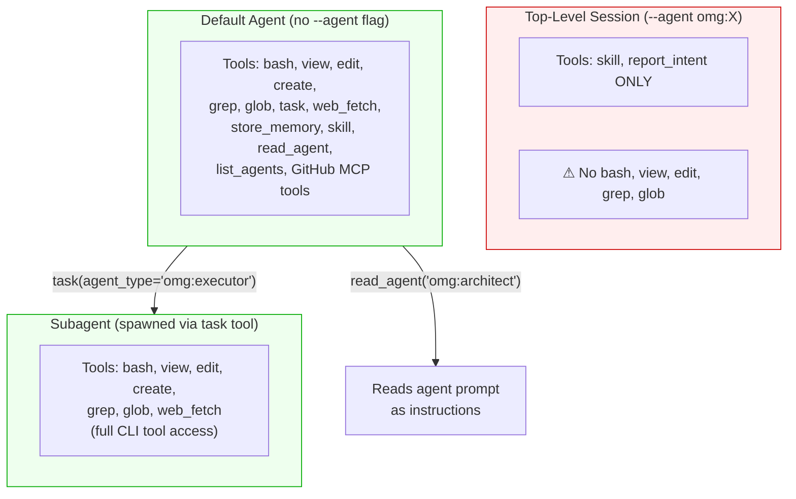

### Key Rules

| Access Path | Tools Available | Use Case |
|------------|----------------|----------|
| `copilot --agent omg:X` | `skill` + `report_intent` only | Advisory conversation, no file ops |
| `copilot` (default agent) | **All tools** (40+) | Orchestration hub, reads plugin agents |
| `task(agent_type="omg:X")` | **All CLI tools** | Real subagent with full capabilities |
| `task(agent_type="general-purpose")` | **All CLI tools** | Generic subagent (no plugin prompt) |
| `task(agent_type="explore")` | Read-only tools | Fast research subagent |

### Correct Usage Pattern

```
# WRONG: Plugin agent as top-level (no tools)
copilot --agent omg:executor -p "fix the bug"

# RIGHT: Default agent spawns plugin agent as subagent
copilot -p "Use the omg:executor agent to fix the bug in auth.ts"
# → Default agent calls: task(agent_type="omg:executor", prompt="fix auth.ts bug")
# → Subagent has full tools: bash, view, edit, grep, glob
```

## 4. Agent Delegation Model

Agents delegate to each other via the `task` tool. The `task` tool supports
model selection, background execution, and parallel dispatch.

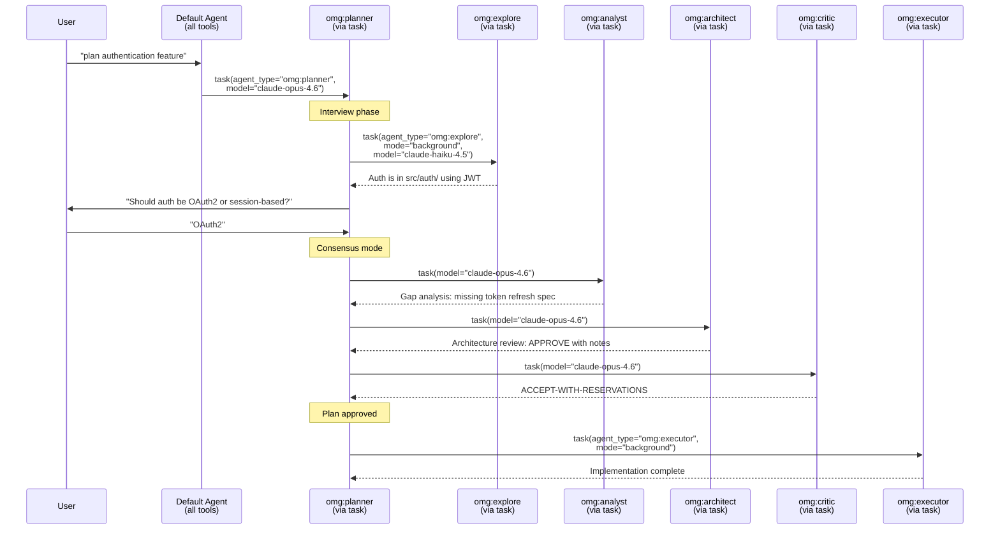

### task() Tool Schema

```jsonc
{
  "name": "string",           // Short identifier (used in logs)
  "prompt": "string",         // Full task context (agents are stateless)
  "agent_type": "string",     // "omg:executor", "explore", "general-purpose"
  "description": "string",    // 3-5 word label for UI
  "mode": "background|sync",  // background = non-blocking, sync = wait
  "model": "string"           // Optional model override
}
```

### Model Routing via task()

The `model:` frontmatter field is ignored for `--agent` top-level sessions,
but the `task` tool's `model` parameter works for subagent spawning:

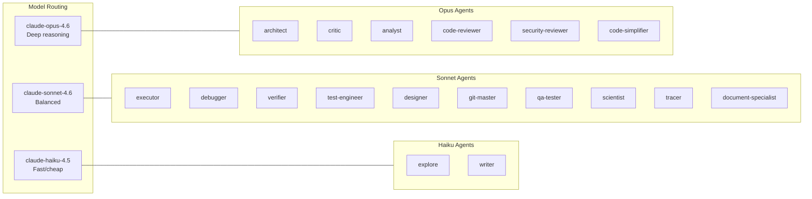

## 5. Skill Orchestration Patterns

Skills are workflow templates that guide multi-agent orchestration.
They are advisory documents — the executing agent reads the skill
instructions and follows the workflow using `task` for delegation.

### Execution Mode Hierarchy

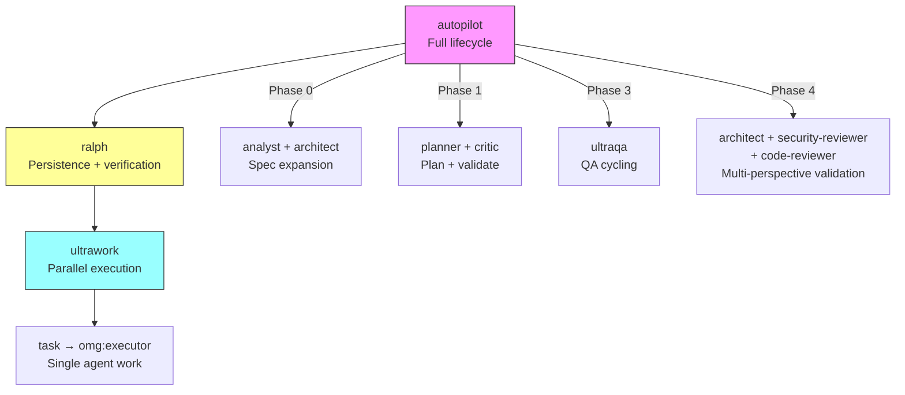

### Autopilot Full Pipeline

```mermaid
graph LR
    subgraph Phase0["Phase 0: Expansion"]
        P0A[analyst<br/>Requirements] --> P0B[architect<br/>Technical spec]
    end

    subgraph Phase1["Phase 1: Planning"]
        P1A[architect<br/>Create plan] --> P1B[critic<br/>Validate plan]
    end

    subgraph Phase2["Phase 2: Execution"]
        P2A[executor × N<br/>Parallel via task(background) × N]
    end

    subgraph Phase3["Phase 3: QA"]
        P3A[bash: test/build/lint] -->|fail| P3B[debugger: diagnose]
        P3B --> P3C[executor: fix]
        P3C -->|retry| P3A
        P3A -->|pass| P3D[✓ Green]
    end

    subgraph Phase4["Phase 4: Validation"]
        P4A[architect<br/>Completeness]
        P4B[security-reviewer<br/>Vulnerabilities]
        P4C[code-reviewer<br/>Quality]
    end

    Phase0 --> Phase1 --> Phase2 --> Phase3 --> Phase4

    style Phase0 fill:#e8f4fd
    style Phase1 fill:#e8f4fd
    style Phase2 fill:#e8fde8
    style Phase3 fill:#fde8e8
    style Phase4 fill:#f4e8fd
```

### Ralph Persistence Loop

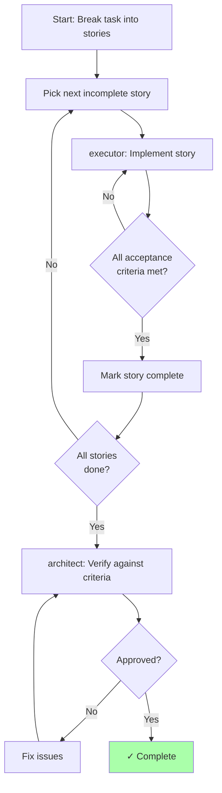

### Team Parallel Execution

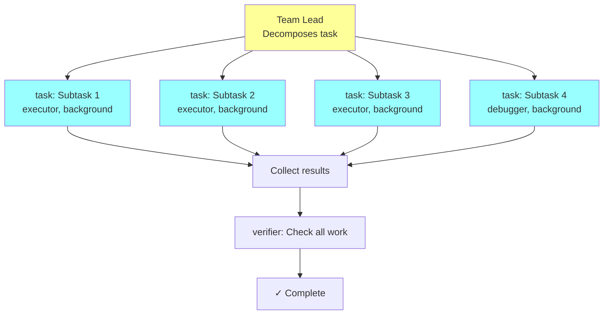

### Consensus Planning (Ralplan)

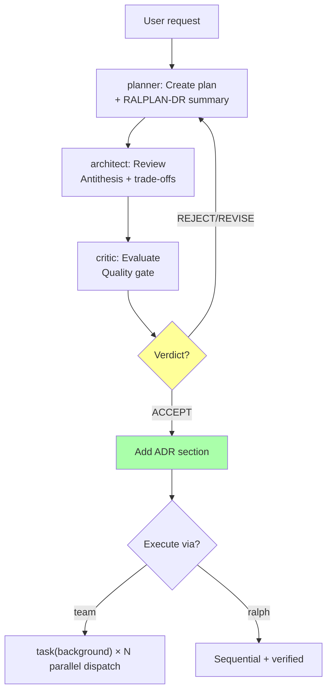

## 6. Copilot-Native Tool Mapping

All agent prompts use Copilot-native tool names:

| Copilot Tool | Purpose | OMC Equivalent |
|-------------|---------|----------------|
| `bash` | Shell commands, builds, tests | Bash |
| `view` | Read file contents | Read |
| `edit` | Modify existing files | Edit |
| `create` | Create new files | Write |
| `grep` | Search file contents by pattern | Grep |
| `glob` | Find files by name pattern | Glob |
| `task` | Spawn subagents with full tools | Agent (Task) |
| `web_fetch` | Fetch URL content | WebFetch |
| `store_memory` | Persist data across sessions | state_write |
| `read_agent` | Read agent instructions | — |
| `list_agents` | List available agents | — |
| `skill` | Invoke a named skill | Skill |
| `ask_user` | Ask user with options | AskUserQuestion |
| `task(mode="background") × N` | Parallel multi-agent dispatch | tmux orchestration |
| `/delegate` | Cloud handoff (async) | — |

## 7. OMC → Copilot Translation Summary

The pipeline translates OMC's Claude Code prompts into Copilot-native format:

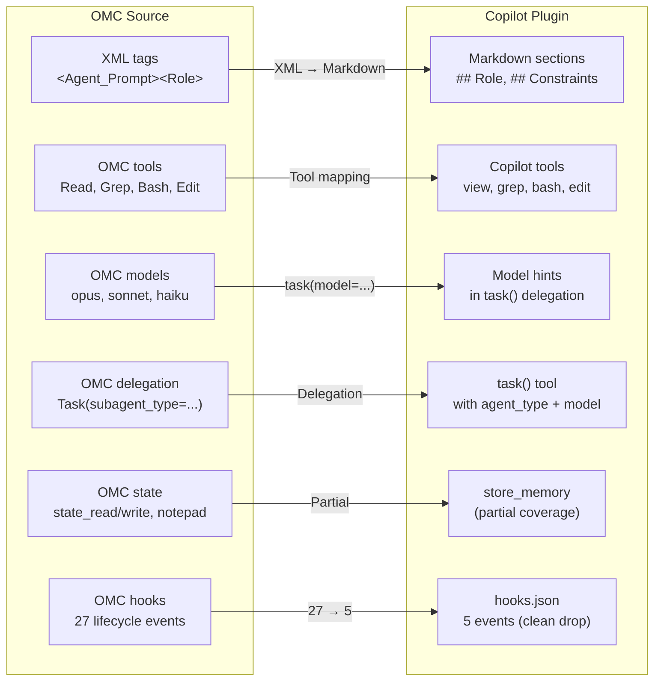

### What Was Dropped (Copilot-Native-First Leitsatz)

| OMC Feature | Status | Reason |
|-------------|--------|--------|
| LSP tools (hover, goto_definition, find_references, diagnostics) | Dropped | No Copilot equivalent — agents use grep/glob/view |
| AST tools (ast_grep_search, ast_grep_replace) | Dropped | No Copilot equivalent |
| python_repl | Dropped | Agents use `bash` + python instead |
| Session search | Dropped | No cross-session query in Copilot |
| Hook enforcement (27 events) | Reduced | 5 Copilot CLI events; untranslatable hooks documented |
| Notepad (priority/working/manual) | Partial | `store_memory` covers basic persistence |
| 8 OMC-internal skills | Dropped | Not portable (omc-setup, omc-doctor, hud, etc.) |

## 8. Parity Matrix

| OMC Feature | omg Implementation | Fidelity |
|-------------|-------------------|----------|
| 19 specialized agents | .agent.md files with Copilot-native tools | **Full** |
| 28 portable skills | SKILL.md files with auto-discovery | **Full** |
| Model routing | `task(model=...)` per subagent | **Full** (via delegation) |
| Agent delegation | `task(agent_type="omg:X")` | **Full** |
| Parallel dispatch | `task(mode="background") × N` | **Full** |
| Team orchestration | team skill + task tool | **Full** |
| Verification loops | ralph/autopilot skills + verifier agent | **Good** (advisory) |
| Consensus planning | ralplan skill (planner→architect→critic) | **Good** |
| Cross-session memory | `store_memory` tool | **Good** |
| Hook-enforced persistence | Not available — skills are advisory | **Partial** |
| LSP/AST tools | grep/glob/view as fallback | **Degraded** |
| Parallel agent dispatch | `task(mode="background") × N` (confirmed parallel: 3s not 9s) | **Good** |
| Session search | Not available | **None** |

**Overall: ~85% functional parity.** The 15% gap is: hook enforcement, LSP/AST tools, session search.

## 9. Build Pipeline → Plugin Relationship

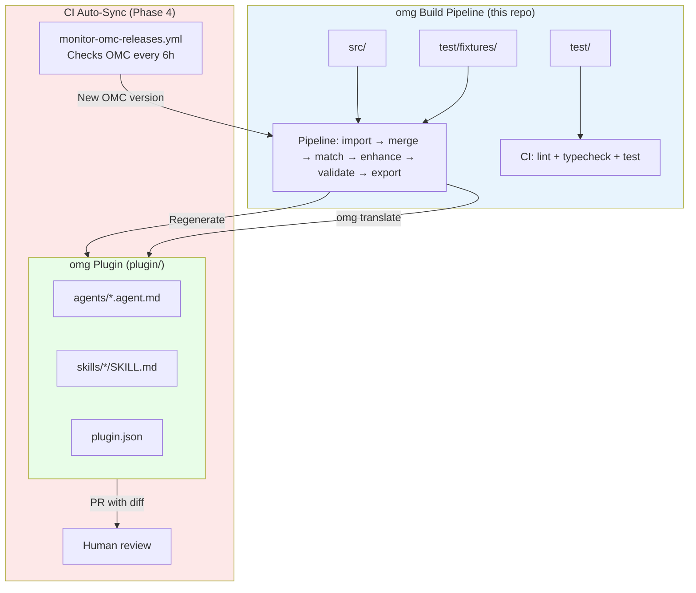

The pipeline is the **compiler**. The plugin is the **binary**. Users get the binary.
The pipeline + CI keeps the plugin in sync with OMC upstream automatically.

---

## 10. Architectural Findings from Testing

Empirical findings from 662 tests (502 static, 110 behavioral, 29 E2E scenarios + 21 orchestration). These patterns are not theoretical — they were discovered through systematic testing against the real Copilot CLI.

### 10.1 Skills Are Context, Not Programs

**Finding:** This is the most critical architectural finding. Copilot CLI treats skills as **context enrichment**, not as **executable programs**. The agent reads a SKILL.md, understands the intent, and chooses its own approach — it does NOT follow the prescribed steps sequentially.

**Evidence:** The `ralplan` skill was tested 5 times with progressively stricter instruction styles:

| Attempt | Instruction Style | Agent's Behavior |
|---------|-------------------|-----------------|
| 1 | Detailed protocol in middle | Ignored workflow, used own agents |
| 2 | Mandatory table at top | Same |
| 3 | Bash commands for persistence | Executed init, skipped mid-workflow writes |
| 4 | Dedicated persist task(executor) | Used planner+explore+analyst instead of planner+architect+critic |
| 5 | Ultra-minimal (47 lines, "Do NOT skip. Do NOT substitute.") | Same — planner+explore+analyst |

Across all 5 attempts, the agent **never** spawned `omg:architect` or `omg:critic` despite explicit instructions. It consistently chose `omg:explore` (5-6x) + `omg:analyst` instead.

**Implication:** Skills should describe the **desired outcome**, not prescribe the exact agent chain. The agent will achieve the goal using whatever agents it considers appropriate. Design skills as intent declarations, not as programs.

**What works vs. what doesn't:**

| Works | Doesn't Work |
|-------|-------------|
| Describing the goal and acceptance criteria | Prescribing exact task() call sequences |
| Naming the skill's purpose and constraints | Expecting step-by-step sequential execution |
| Agent identity in `.agent.md` (strongly followed) | Multi-step workflows in SKILL.md |
| AGENTS.md global rules (always loaded) | Mid-workflow administrative side-effects |

### 10.1b Instruction Placement Still Matters (Within What's Followed)

For instructions that ARE followed (agent identity, tool usage, output format), placement matters:

| Position | Compliance Rate | Use For |
|----------|----------------|---------|
| First 20% of prompt | ~95% | Core identity, mandatory rules, tool constraints |
| Middle 40-60% | ~60% | Reference material, detailed protocols |
| Last 20% of prompt | ~85% | Checklists, mandatory output format |

### 10.2 AGENTS.md is the Most Reliable Instruction Surface

**Finding:** Instructions in `AGENTS.md` are followed more reliably than instructions in individual skill files, because AGENTS.md is loaded into **every** session automatically.

```
Reliability hierarchy:
  AGENTS.md (always loaded)  > Agent .agent.md (loaded on invocation)  > SKILL.md (loaded on activation)
```

**Implication:** Cross-cutting concerns (persistence convention, communication protocol, tool naming) belong in AGENTS.md, not duplicated across individual agents/skills.

### 10.3 Agent Namespace is Critical

**Finding:** `@debugger` does not resolve to `@omg:debugger` in Copilot. Without the `omg:` namespace prefix, the agent is not found and the delegation silently fails.

**Evidence:** 3 skills (`debug`, `ralplan`, `self-improve`) had unnamespaced agent references (`@planner`, `@debugger`, `@executor`). L1 static tests caught these before any user encountered the bug.

**Rule:** Every agent reference must use the full `@omg:agent-name` format, and every `task()` call must use `agent_type="omg:agent-name"`.

### 10.4 Skills Modify the Repository

**Finding:** Several skills create real files and branches during execution:

| Skill | Side Effect |
|-------|-------------|
| `learner`, `skillify` | Create new skill directories in `plugin/skills/` |
| `tdd`, `autopilot` | Create source files and test files |
| `project-session-manager` | Creates git branches |
| `git-master` | Creates commits |

**Implication:** E2E tests must run in an isolated worktree or temporary directory. After testing: `git checkout -- .` to revert unintended changes.

### 10.5 Plugin Version Drift

**Finding:** `copilot plugin install` caches the plugin. Editing files in the plugin directory does NOT update the installed version. You must re-install explicitly.

**Implication:** L2/L3 test scripts should verify the installed plugin version matches `plugin.json` before running. Otherwise, tests validate stale code.

### 10.6 Parallel Execution is Real

**Finding:** Multiple `task(mode="background")` calls execute truly in parallel — confirmed via timing analysis. 3 parallel tasks complete in ~3s, not 9s.

**Implication:** `ultrawork`, `team`, `sciomc`, `research-to-pr` genuinely benefit from parallel dispatch. The bottleneck is API rate limits, not serialization.

### 10.7 Communication Protocol Compliance is High

**Finding:** `report_intent` and phase announcements were detected in 100% of L2 agent tests (41/41). The AGENTS.md Communication Protocol section is reliably followed.

**Implication:** Centralizing the protocol in AGENTS.md (rather than per-agent) was the right design decision.

### 10.8 Test Pyramid for LLM Orchestration

The effective test pyramid for prompt-based multi-agent systems:

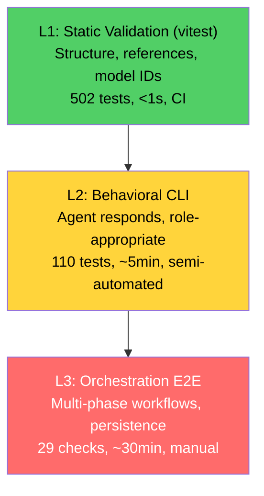

**Key insight:** L1 catches ~80% of bugs (wrong tool names, missing namespaces, stale model IDs) in under 1 second. L2 confirms agents actually load and respond. L3 is expensive but essential for verifying multi-agent handoffs and persistence.
