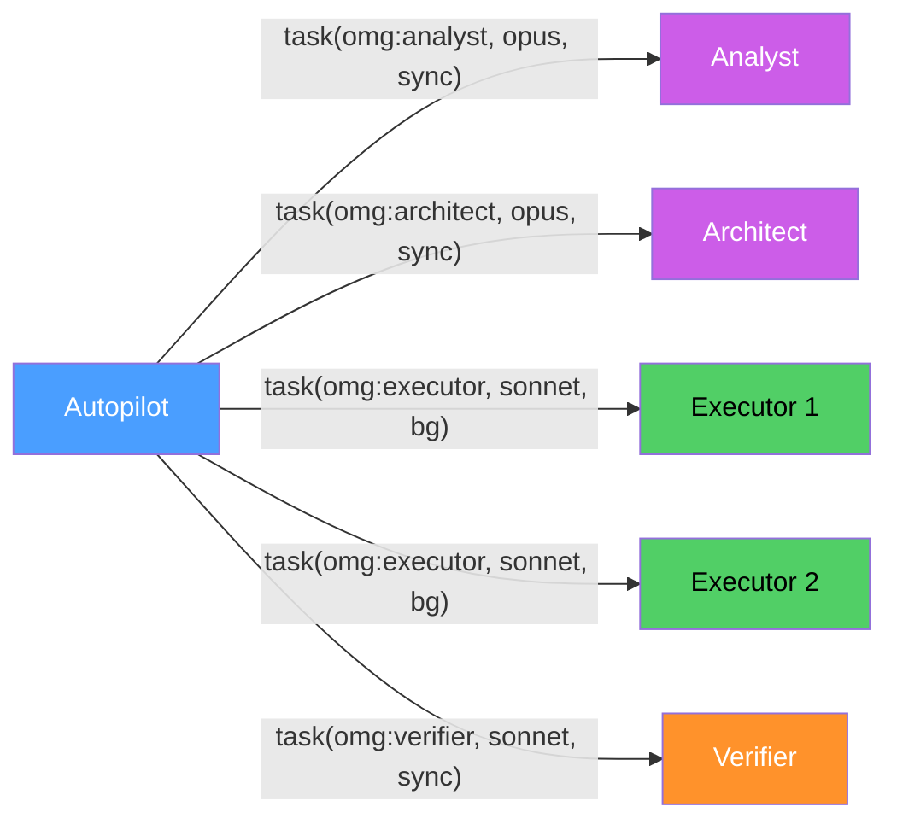

# Copilot Capabilities Used by omg

This document maps every GitHub Copilot capability that omg leverages.
It serves as both a reference and a differentiation argument — these features
are why omg exists specifically for Copilot, not as a generic AI tool.

---

## Plugin System

| Capability | How omg Uses It | Status |
|-----------|----------------|--------|
| `copilot plugin install` | One-command installation from GitHub repo | Active |
| `plugin.json` manifest | Declares 19 agents + 37 skills + hooks | Active |
| `agents/` directory | 19 specialized `.agent.md` files auto-discovered | Active |
| `skills/` directory | 37 `SKILL.md` files auto-discovered by keyword | Active |
| `AGENTS.md` | Global config loaded into every session | Active |
| Plugin versioning | `version` field in plugin.json for update detection | Active |

## Agent Architecture

| Capability | How omg Uses It | Status |
|-----------|----------------|--------|
| `.agent.md` format | YAML frontmatter (name, description, model, tools) + Markdown body | Active |
| Agent invocation (`--agent`) | `copilot -p "..." --agent omg:explorer` | Active |
| Agent namespace (`omg:`) | All 19 agents prefixed for collision avoidance | Active |
| `report_intent` tool | Live status updates during agent work (4-word gerund phrases) | Active |
| `skill` tool | Agents activate skills by name | Active |

## Task System (Multi-Agent Orchestration)

This is omg's most critical Copilot dependency — the `task()` API enables everything.

| Capability | How omg Uses It | Status |
|-----------|----------------|--------|
| `task(agent_type, prompt, model, mode)` | All inter-agent delegation (19 agents routing to each other) | Active |
| `mode="background"` | Parallel execution — multiple agents simultaneously | Active |
| `mode="sync"` | Sequential execution — wait for result before proceeding | Active |
| `model` parameter | Per-task model selection (haiku/sonnet/opus) | Active |
| Background task completion | Autopilot mode waits for all background agents | Active |



## Multi-Model Routing

| Capability | How omg Uses It | Status |
|-----------|----------------|--------|
| `claude-haiku-4.5` | Fast lookups: explore, writer | Active |
| `claude-sonnet-4.6` | Standard work: executor, debugger, verifier, test-engineer, designer, git-master, scientist, tracer, document-specialist, qa-tester | Active |
| `claude-opus-4.6` | Deep analysis: architect, analyst, planner, critic, code-reviewer, security-reviewer, code-simplifier | Active |
| Per-task model override | Each `task()` call specifies optimal model for the job | Active |

**Cost optimization:** A full autopilot run uses haiku for exploration (~$0.01), sonnet for implementation (~$0.10), and opus only for architecture review (~$0.30). Without multi-model routing, everything would run on opus (~$2.00+).

## Persistence

| Capability | How omg Uses It | Status |
|-----------|----------------|--------|
| `store_memory` | Cross-session index: `omg:active-plan`, `omg:active-spec`, `omg:last-review` | Active |
| File system (`edit`, `create`) | Plans, research, reviews, QA logs in `.omg/` directories | Active |

```
.omg/
├── plans/          # Work plans with acceptance criteria
├── research/       # Analysis output, specs, findings  
├── reviews/        # Review verdicts, critique feedback
└── qa-logs/        # Iteration state for cyclical workflows
```

## CLI Flags

| Flag | How omg Uses It | Status |
|------|----------------|--------|
| `-p / --prompt` | Non-interactive single-shot mode for testing | Active |
| `-i` | Interactive mode for user sessions | Active |
| `-s` | Suppress decoration for clean script output | Active |
| `--yolo` | Auto-approve tool permissions in testing/CI | Active |
| `--autopilot` | Keep running until task complete (ralph, autopilot) | Active |
| `--max-autopilot-continues N` | Bound iteration count for safety | Active |
| `--output-format json` | JSONL output for log-based verification | Active |
| `--agent NAME` | Direct agent invocation | Active |

## Cloud Delegation (Copilot-Exclusive)

| Capability | How omg Uses It | Status |
|-----------|----------------|--------|
| `/delegate` | Hand off implementation to cloud agent → automatic PR | Active (research-to-pr skill) |
| Cloud agent PR creation | Research locally, implement in cloud, PR automatically | Active |

This is omg's flagship differentiator — no other AI coding tool can investigate locally and create a PR via cloud agent in a single workflow.

## GitHub Integration (via MCP)

| Capability | How omg Uses It | Status |
|-----------|----------------|--------|
| GitHub MCP tools | Search issues, PRs, code across repositories | Available |
| `web_fetch` | External documentation lookup (fallback when MCP unavailable) | Active |

## Microsoft Skills Ecosystem

| Capability | How omg Uses It | Status |
|-----------|----------------|--------|
| `copilot plugin list` | Detect installed Microsoft plugins | Active |
| `copilot plugin install` | Offer installation of Fabric, Azure SQL, DevOps plugins | Active |
| Cross-plugin orchestration | omg agents use Microsoft Skills when installed | Active |

## Hooks

| Capability | How omg Uses It | Status |
|-----------|----------------|--------|
| `hooks.json` | 5 CLI events: sessionStart, sessionEnd, userPromptSubmitted, preToolUse, postToolUse | Active |
| Hook command execution | Lint-on-write, context injection, state saving | Active |

---

## Capabilities NOT Used (and Why)

| Capability | Why Not Used |
|-----------|-------------|
| `/fleet` | IDE-only, not available in CLI |
| VS Code extended events (8) | CLI has 5 events; VS Code adds subagentStart, subagentStop, errorOccurred — supported in vscode export target |
| Copilot Workspace | Different product, not CLI-compatible |
| Copilot for PRs (review) | Separate feature, not plugin-accessible |

---

## Capability Dependencies

If any of these Copilot capabilities were removed, omg would break:

| Capability | Impact if Removed | Severity |
|-----------|-------------------|----------|
| `task()` API | All multi-agent orchestration stops | **Critical** |
| `.agent.md` format | No agent loading | **Critical** |
| `SKILL.md` format | No skill loading | **Critical** |
| `AGENTS.md` auto-load | Global config not applied | **High** |
| `store_memory` | Cross-session context lost | **Medium** |
| `model` parameter in task() | All agents run on default model (no cost optimization) | **Medium** |
| `mode="background"` | No parallel execution (serial only) | **Medium** |
| `--autopilot` flag | ralph/autopilot cannot loop autonomously | **Medium** |
| `/delegate` | research-to-pr loses cloud handoff (still works locally) | **Low** |
