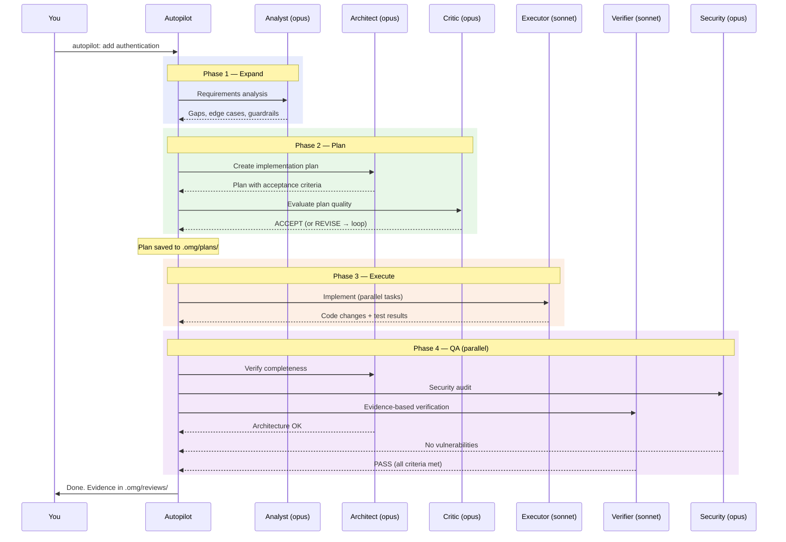
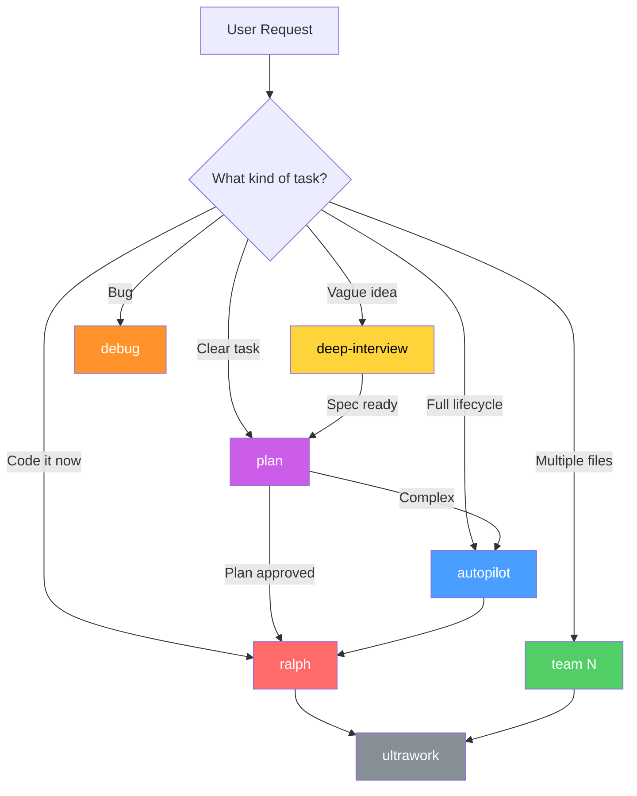

# omg — Multi-Agent Orchestration for GitHub Copilot

**25 AI agents. 42 skills. One plugin.**

omg turns GitHub Copilot CLI into a multi-agent development platform. Instead of one AI assistant doing everything, omg gives you a team of specialists — an architect who analyzes code, a debugger who traces root causes, a critic who reviews plans, an executor who implements changes — all coordinating autonomously through structured workflows.

## Why omg?

| Without omg | With omg |
|------------|---------|
| One generalist AI | 19 specialists, each best at their job |
| Manual step-by-step prompting | Autonomous multi-phase workflows |
| Hope it works, check manually | Built-in verification with evidence |
| Forget context between sessions | Persistent memory across sessions |
| Single model for everything | Right model per task (haiku for speed, opus for depth) |

## See It In Action

### About omg


### Quick Side-Question (btw)


### Codebase Exploration


### Multi-Language Routing


## Install

One command:
```bash
copilot plugin install TheTrustedAdvisor/omg
```

That's it. 25 agents + 42 skills, ready to use.

<details>
<summary>Alternative install methods</summary>

```bash
# SSH (if HTTPS doesn't work)
copilot plugin install git@github.com:TheTrustedAdvisor/omg.git

# From local clone (development)
git clone https://github.com/TheTrustedAdvisor/omg-dev.git
cd omg-dev
./install.sh

# Temporary (no install, session only)
copilot --plugin-dir ./plugin
```
</details>

## Quick Start — Just Say What You Want

No special syntax needed. Describe what you want:

```bash
# Plan a feature with structured requirements
copilot -i "Plan how to add authentication to this project"

# Fix a bug — root cause analysis, not guesswork
copilot -i "Debug why the tests are failing in src/pipeline/"

# Security audit with severity ratings and fix suggestions
copilot -i "Review the security of src/config.ts"

# Build something from scratch — fully autonomous
copilot -i "autopilot: build a REST API for user management"

# Keep working until it's done — no "it should work"
copilot -i "ralph: add input validation to all CLI commands"

# 5 agents working in parallel on independent tasks
copilot -i "team 5: fix all TypeScript errors across src/"

# Investigate → implement → create PR (Copilot-exclusive)
copilot -i "research-to-pr: fix the auth token expiry bug"
```

Copilot picks the right agents and skills automatically.

**Works in any language** — speak German, French, Japanese, or any language. omg translates your intent and responds in your language:

```bash
copilot -i "omg prüfe die Sicherheit dieses Projekts"     # German → security review
copilot -i "omg vérifie la sécurité de ce projet"          # French → security audit
copilot -i "omg このプロジェクトのセキュリティを確認して"        # Japanese → security check
```

### Workflows at a Glance

| Say this | What happens |
|----------|-------------|
| `plan...` | Structured interview → plan with testable acceptance criteria |
| `autopilot...` | Full lifecycle: plan → implement → test → validate |
| `ralph...` | Persistent loop until ALL acceptance criteria pass with evidence |
| `team N...` | N parallel agents, each on independent files, verified together |
| `trace...` | Competing hypotheses ranked by evidence strength |
| `deep interview...` | Socratic Q&A with ambiguity scoring — proceed when clarity ≥ 80% |
| `tdd...` | Red-green-refactor: failing test first, then minimal code |
| `research-to-pr...` | Investigate → implement → cloud agent creates PR automatically |
| `deepsearch...` | Multi-angle codebase exploration, not just grep |
| `ultrathink...` | Deep reasoning on complex architectural decisions |

## How It Works — Real Multi-Agent Orchestration

Not just prompts — agents delegate to each other, persist handoffs to files, and verify each other's work. Here's what happens when you say `autopilot: add authentication`:



### What Makes This Different

| Traditional AI | omg Orchestration |
|---------------|-------------------|
| One model does everything | 6 specialists, each best at their job |
| "It should work" | Verifier ran `npm test` and saw green |
| Forgets context between steps | Plans, research, reviews persist in `.omg/` |
| Single pass, hope for the best | Critic rejects → Planner revises → loop until approved |
| Same model for search and architecture | Haiku for speed, Opus for depth |

### The Orchestration Patterns

omg provides several orchestration patterns, each for different needs:



**autopilot** wraps ralph (persistence + verification), which wraps ultrawork (parallel execution). Each layer adds capability:

| Layer | What it adds | When to use |
|-------|-------------|-------------|
| **ultrawork** | Parallel agent dispatch | Independent tasks, speed matters |
| **ralph** | Persistence loop + verification | Must complete with evidence |
| **autopilot** | Full lifecycle (plan→execute→QA) | From idea to working code |
| **team N** | N parallel workers + coordination | Large tasks, multiple files |

### Verified Completion

Every claim is backed by evidence. "Tests pass" means the verifier ran `npm test` and saw green. No "it should work" — only "here's the proof."

### Cross-Session Memory

Decisions, plans, and review results survive across sessions:

| What | Where | Survives restart? |
|------|-------|-------------------|
| Plans | `.omg/plans/` | Yes (file) |
| Research | `.omg/research/` | Yes (file) |
| Reviews | `.omg/reviews/` | Yes (file) |
| Context index | `store_memory` | Yes (Copilot-native) |

### Copilot-Exclusive Capabilities

Features that only work on Copilot, not on other AI coding tools:

| Capability | What it enables |
|-----------|----------------|
| **Multi-model routing** | Haiku for speed, Sonnet for coding, Opus for architecture |
| **Parallel agents** | 5 workers on 5 files simultaneously (proven: 3s not 9s) |
| **Cloud handoff** | `/delegate` sends work to cloud agent → automatic PR |
| **GitHub integration** | Native MCP access to issues, PRs, code search |
| **Reasoning control** | `--effort low/xhigh` per task for cost optimization |

## The 28 Agents

### 9 Orchestrators (decide HOW to execute)

| Agent | Specialty | When it's called |
|-------|----------|-----------------|
| **autopilot** | Full lifecycle: idea → working code | "autopilot", "build me", "handle it all" |
| **ralph** | Persistence loop until criteria pass | "ralph", "don't stop", "must complete" |
| **team** | N parallel workers on independent tasks | "team 3", "assemble a team" |
| **ralplan** | Consensus: planner → architect → critic | "ralplan", "consensus" |
| **ultrawork** | Fire parallel tasks simultaneously | "ultrawork", "ulw" |
| **research-to-pr** | Investigate → cloud agent → auto PR | "research and fix", "investigate and PR" |
| **sciomc** | Staged parallel research with scientists | "sciomc", "research" |
| **self-improve** | Benchmark, tournament-select best approach | "self-improve", "optimize" |
| **deep-dive** | Trace root cause → crystallize into spec | "deep dive", "investigate deeply" |

### 19 Specialists (know WHAT to do)

| Agent | Specialty | When it's called |
|-------|----------|-----------------|
| **architect** | Architecture analysis, trade-offs | Plan review, design decisions |
| **critic** | Multi-perspective quality gate | Final approval before execution |
| **analyst** | Requirements gaps, edge cases | Before planning starts |
| **planner** | Structured plans with acceptance criteria | "plan", "how should we" |
| **executor** | Code implementation, smallest diff | Actual coding work |
| **debugger** | Root cause analysis, minimal fix | Bugs, build failures |
| **verifier** | Evidence-based PASS/FAIL | After every implementation |
| **code-reviewer** | Severity-rated review, SOLID | Code quality checks |
| **security-reviewer** | OWASP Top 10, secrets, deps | Security audits |
| **test-engineer** | TDD, test strategy, flaky tests | Test writing |
| **explore** | Fast codebase search | Finding files and patterns |
| **designer** | Production-grade UI | Frontend work |
| **git-master** | Atomic commits, style-matching | Git operations |
| **tracer** | Competing hypotheses with evidence | "Why did this happen?" |
| **scientist** | Statistical analysis with rigor | Data investigations |
| **writer** | Verified documentation | README, API docs |
| **document-specialist** | External API references | Library/framework questions |
| **code-simplifier** | Remove complexity, keep behavior | Refactoring |
| **qa-tester** | Interactive CLI testing | End-to-end validation |

## 36 Skills

**Execution:** autopilot, ralph, team, ultrawork
**Planning:** plan, ralplan, deep-interview, deep-dive
**Quality:** ultraqa, verify, tdd, ai-slop-cleaner
**Analysis:** trace, deep-analyze, deepsearch, ultrathink, sciomc
**Flagship:** research-to-pr (investigate → cloud agent → automatic PR)
**Utilities:** debug, release, cancel, session-memory, ask, ccg, deepinit, external-context, learner, skillify, self-improve, writer-memory, project-session-manager, configure-notifications, visual-verdict
**Reference:** agent-catalog, handoff-protocol

## Documentation

- [Architecture](docs/architecture/plugin.md) — How it works under the hood + empirical findings
- [Copilot Capabilities](docs/architecture/copilot-capabilities.md) — Every Copilot feature omg uses
- [Examples](EXAMPLES.md) — 10 copy-paste demos with expected output
- [Best Practices](BEST-PRACTICES.md) — Dos, don'ts, documentation standards
- [Limitations](docs/reviews/limitations.md) — Known gaps and platform limitations
- [All docs](docs/README.md) — Full documentation index

## Credits

omg's agent architecture is inspired by [oh-my-claudecode](https://github.com/Yeachan-Heo/oh-my-claudecode) (OMC), adapted and extended for GitHub Copilot's native capabilities. omg adds multi-model routing, parallel execution, cloud delegation, and GitHub-native integration that OMC's Claude Code platform cannot provide.

## License

MIT
