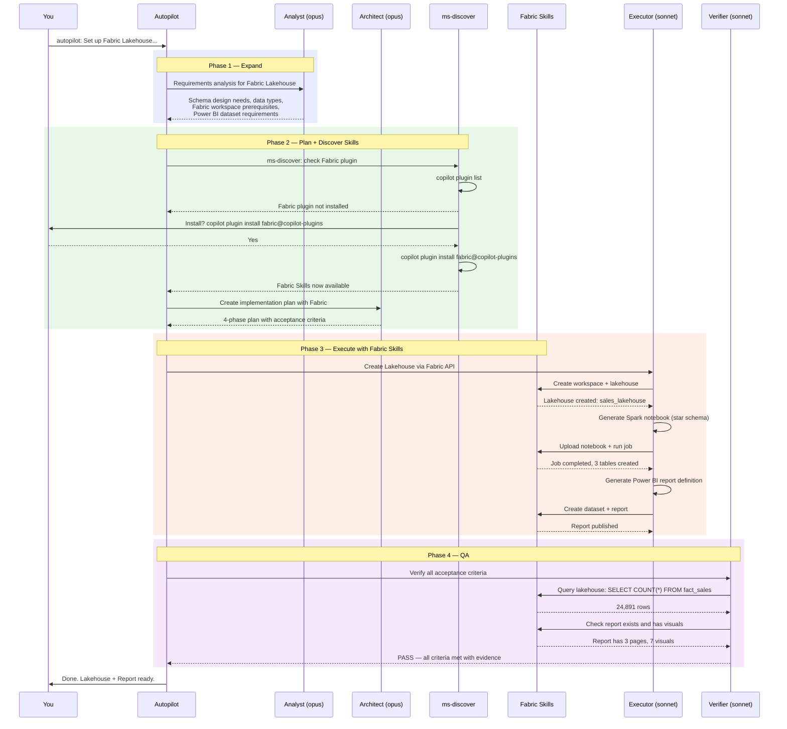

# Sample: Building a Fabric Lakehouse + Power BI Report with omg

This walkthrough shows how omg orchestrates a real-world data engineering task:
setting up a Microsoft Fabric Lakehouse, loading data, and creating a Power BI report —
using omg agents + Microsoft Fabric Skills together.

---

## The Scenario

You have CSV sales data and need:
1. A Fabric Lakehouse with proper schema
2. Data loaded and transformed via Spark notebooks
3. A Power BI report with interactive visuals

**One command. Multiple agents. Fabric Skills integrated.**

```bash
copilot -i "autopilot: Set up a Fabric Lakehouse for our sales data (CSV in /data/sales_2024.csv), create a star schema, load the data with a Spark notebook, and build a Power BI report showing revenue by region and product"
```

---

## What Happens Under the Hood



---

## Step-by-Step Breakdown

### Step 1: Plugin Discovery

omg automatically checks if the Fabric plugin is installed:

```bash
# omg runs this internally via ms-discover skill
copilot plugin list
# Output: No Fabric plugin found

# omg offers installation:
# "The Fabric plugin would let me create the lakehouse directly. Install?"
copilot plugin install fabric@copilot-plugins
# Output: Plugin "fabric" installed successfully.
```

After installation, Fabric Skills are available to all omg agents:

```mermaid
graph LR
    subgraph omg["omg Agents"]
        AR[Architect]
        EX[Executor]
        DB[Debugger]
        VR[Verifier]
    end

    subgraph Fabric["Fabric Skills (Microsoft)"]
        LH[Create Lakehouse]
        NB[Run Notebook]
        QR[Query Data]
        RP[Create Report]
    end

    AR -->|"schema design"| QR
    EX -->|"create + load"| LH
    EX -->|"transform"| NB
    EX -->|"report"| RP
    DB -->|"diagnose"| QR
    VR -->|"verify"| QR

    style omg fill:rgba(74,158,255,0.1),stroke:#4a9eff
    style Fabric fill:rgba(81,207,102,0.1),stroke:#51cf66
```

### Step 2: Architect Designs the Star Schema

The architect agent analyzes the CSV and designs the schema:

```bash
# omg spawns architect (opus) with Fabric context
task(agent_type="omg:architect", model="claude-opus-4.6", mode="sync",
  prompt="Design a star schema for sales_2024.csv. Columns: date, region, 
  product, category, quantity, unit_price, discount, customer_id. 
  Target: Fabric Lakehouse with Delta tables.")
```

Architect output:

```
Star Schema Design
==================

fact_sales (Delta table)
├── sale_id (BIGINT, generated)
├── date_key (INT, FK → dim_date)
├── region_key (INT, FK → dim_region)
├── product_key (INT, FK → dim_product)
├── customer_id (STRING)
├── quantity (INT)
├── unit_price (DECIMAL(10,2))
├── discount (DECIMAL(5,2))
└── revenue (DECIMAL(12,2), computed: quantity * unit_price * (1 - discount))

dim_date
├── date_key (INT, PK, format: YYYYMMDD)
├── date (DATE)
├── year (INT)
├── quarter (STRING)
├── month (STRING)
└── day_of_week (STRING)

dim_region
├── region_key (INT, PK, auto)
├── region_name (STRING)
└── country (STRING)

dim_product
├── product_key (INT, PK, auto)
├── product_name (STRING)
└── category (STRING)
```

### Step 3: Executor Creates the Lakehouse

```bash
# Executor uses Fabric Skills to create the workspace
task(agent_type="omg:executor", model="claude-sonnet-4.6", mode="sync",
  prompt="Create Fabric Lakehouse 'sales_lakehouse' with star schema from 
  architect spec. Upload sales_2024.csv. Create Spark notebook for ETL.")
```

The executor generates a PySpark notebook:

```python
# ETL Notebook: load_sales_data.py (generated by omg:executor)

from pyspark.sql import SparkSession
from pyspark.sql.functions import col, year, quarter, month, dayofweek, monotonically_increasing_id

spark = SparkSession.builder.getOrCreate()

# Load raw CSV from lakehouse Files section
raw = spark.read.csv("Files/sales_2024.csv", header=True, inferSchema=True)

# Build dimension tables
dim_date = (raw.select("date").distinct()
    .withColumn("date_key", year("date") * 10000 + month("date") * 100 + dayofweek("date"))
    .withColumn("year", year("date"))
    .withColumn("quarter", quarter("date"))
    .withColumn("month", month("date"))
    .withColumn("day_of_week", dayofweek("date")))

dim_region = (raw.select("region").distinct()
    .withColumn("region_key", monotonically_increasing_id())
    .withColumnRenamed("region", "region_name"))

dim_product = (raw.select("product", "category").distinct()
    .withColumn("product_key", monotonically_increasing_id())
    .withColumnRenamed("product", "product_name"))

# Build fact table with computed revenue
fact_sales = (raw
    .join(dim_date, "date")
    .join(dim_region, raw.region == dim_region.region_name)
    .join(dim_product, (raw.product == dim_product.product_name) & (raw.category == dim_product.category))
    .withColumn("revenue", col("quantity") * col("unit_price") * (1 - col("discount")))
    .select("date_key", "region_key", "product_key", "customer_id", 
            "quantity", "unit_price", "discount", "revenue"))

# Write Delta tables to lakehouse
dim_date.write.format("delta").mode("overwrite").saveAsTable("dim_date")
dim_region.write.format("delta").mode("overwrite").saveAsTable("dim_region")
dim_product.write.format("delta").mode("overwrite").saveAsTable("dim_product")
fact_sales.write.format("delta").mode("overwrite").saveAsTable("fact_sales")

print(f"Loaded {fact_sales.count()} rows into fact_sales")
print(f"Dimensions: {dim_date.count()} dates, {dim_region.count()} regions, {dim_product.count()} products")
```

### Step 4: Power BI Report

The executor creates a Power BI report definition:

```bash
# Executor creates report using Fabric Skills
task(agent_type="omg:executor", model="claude-sonnet-4.6", mode="sync",
  prompt="Create Power BI report from sales_lakehouse. 
  Page 1: Revenue overview (KPI cards + line chart by month).
  Page 2: Regional breakdown (map + bar chart).
  Page 3: Product analysis (treemap + top 10 table).")
```

```mermaid
graph TD
    subgraph Report["Power BI Report: Sales Dashboard"]
        subgraph P1["Page 1: Revenue Overview"]
            KPI1["KPI: Total Revenue<br/>$2.4M"]
            KPI2["KPI: Avg Order Value<br/>$96.40"]
            KPI3["KPI: Total Orders<br/>24,891"]
            LC["Line Chart<br/>Revenue by Month"]
        end
        subgraph P2["Page 2: Regional Breakdown"]
            MAP["Map Visual<br/>Revenue by Region"]
            BAR["Bar Chart<br/>Top 5 Regions"]
        end
        subgraph P3["Page 3: Product Analysis"]
            TM["Treemap<br/>Revenue by Category"]
            TBL["Table<br/>Top 10 Products"]
        end
    end

    LH["Fabric Lakehouse<br/>sales_lakehouse"] --> Report

    style Report fill:rgba(255,180,0,0.1),stroke:#f59f00
    style P1 fill:rgba(74,158,255,0.1),stroke:#4a9eff
    style P2 fill:rgba(81,207,102,0.1),stroke:#51cf66
    style P3 fill:rgba(204,93,232,0.1),stroke:#cc5de8
    style LH fill:rgba(100,100,100,0.1),stroke:#868e96
```

### Step 5: Verification

The verifier checks every acceptance criterion with fresh evidence:

```bash
task(agent_type="omg:verifier", model="claude-sonnet-4.6", mode="sync",
  prompt="Verify: (1) Lakehouse exists with 4 Delta tables, 
  (2) fact_sales has >0 rows, (3) Report exists with 3 pages")
```

Verifier output:

```
Verification Report
===================

[VERIFIED] Lakehouse 'sales_lakehouse' exists
  Evidence: Fabric API returned workspace_id=abc123, lakehouse_id=def456

[VERIFIED] 4 Delta tables present
  Evidence: SHOW TABLES → dim_date, dim_region, dim_product, fact_sales

[VERIFIED] fact_sales has 24,891 rows
  Evidence: SELECT COUNT(*) FROM fact_sales → 24891

[VERIFIED] Power BI report exists with 3 pages
  Evidence: Report API → report_id=ghi789, pages=["Revenue Overview", "Regional Breakdown", "Product Analysis"]

[VERIFIED] Report has interactive visuals
  Evidence: 7 visuals across 3 pages (3 KPIs, 1 line chart, 1 map, 1 bar, 1 treemap, 1 table... wait, that's 8)

Verdict: PASS
Confidence: HIGH
All 5 acceptance criteria verified with fresh evidence.
```

---

## The Full Agent Flow

```mermaid
graph TD
    U["copilot -i 'autopilot: Set up Fabric Lakehouse...'"] --> AP[Autopilot]
    
    AP -->|Phase 1| AN["Analyst (opus)<br/>Requirements + schema needs"]
    AP -->|Phase 2| MS["ms-discover<br/>Install Fabric plugin"]
    AP -->|Phase 2| AR["Architect (opus)<br/>Star schema design"]
    AP -->|Phase 2| CR["Critic (opus)<br/>Plan approval"]
    
    AP -->|Phase 3| EX1["Executor (sonnet)<br/>Create Lakehouse"]
    AP -->|Phase 3| EX2["Executor (sonnet)<br/>Spark ETL notebook"]
    AP -->|Phase 3| EX3["Executor (sonnet)<br/>Power BI report"]
    
    EX1 --> FB1["Fabric: Create Workspace"]
    EX2 --> FB2["Fabric: Run Notebook"]
    EX3 --> FB3["Fabric: Create Report"]
    
    AP -->|Phase 4| VR["Verifier (sonnet)<br/>Evidence-based check"]
    VR --> FB4["Fabric: Query tables"]
    VR --> FB5["Fabric: Check report"]
    
    VR -->|"PASS"| DONE["Done. Lakehouse + Report ready."]
    
    style AP fill:#4a9eff,color:#fff
    style AN fill:#cc5de8,color:#fff
    style AR fill:#cc5de8,color:#fff
    style CR fill:#cc5de8,color:#fff
    style EX1 fill:#51cf66,color:#000
    style EX2 fill:#51cf66,color:#000
    style EX3 fill:#51cf66,color:#000
    style VR fill:#ff922b,color:#fff
    style MS fill:#ffd43b,color:#000
    style DONE fill:#2b8a3e,color:#fff
    style FB1 fill:rgba(0,120,212,0.2),stroke:#0078d4
    style FB2 fill:rgba(0,120,212,0.2),stroke:#0078d4
    style FB3 fill:rgba(0,120,212,0.2),stroke:#0078d4
    style FB4 fill:rgba(0,120,212,0.2),stroke:#0078d4
    style FB5 fill:rgba(0,120,212,0.2),stroke:#0078d4
```

---

## Key Takeaways

1. **One command** triggered 8 agent invocations across 4 phases
2. **Microsoft Fabric Skills** were auto-discovered and installed on demand
3. **Multi-model routing** used opus for design ($0.30) and sonnet for execution ($0.10 each)
4. **Parallel execution** ran 3 executor tasks simultaneously (Phase 3)
5. **Verified completion** — the verifier queried Fabric directly for evidence, not just "it should work"
6. **Everything persisted** — plan in `.omg/plans/`, schema in `.omg/research/`, verification in `.omg/reviews/`

### Without omg vs. With omg

| Without omg | With omg |
|------------|---------|
| Manually create workspace in Fabric portal | One command, auto-provisioned |
| Write PySpark notebook from scratch | Architect designs schema, executor generates code |
| Build Power BI report manually | Report definition generated from spec |
| Hope it works, check manually | Verifier queries Fabric API for proof |
| 2-4 hours of manual work | ~5 minutes, fully autonomous |

### Try It Yourself

```bash
# Install omg
copilot plugin install TheTrustedAdvisor/omg

# Run the scenario (with your own CSV path)
copilot -i "autopilot: Set up a Fabric Lakehouse for sales data in /data/sales.csv, 
  create a star schema, and build a Power BI dashboard"
```
