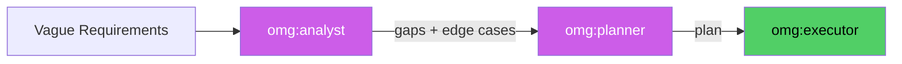

# omg:analyst

Find what is MISSING in requirements — gaps, edge cases, undefined guardrails, hidden assumptions. Feeds into planner. Use BEFORE creating a plan.

## Synopsis

```bash
copilot --agent omg:analyst -p "describe your role in one sentence" -s --yolo
copilot -i "use omg:analyst to help with this"
```

## Description



Find what is MISSING in requirements — gaps, edge cases, undefined guardrails, hidden assumptions. Feeds into planner. Use BEFORE creating a plan.

## Model

`claude-opus-4.6`

## Tools

`view,grep,glob,task`

## Example

```bash
copilot --agent omg:analyst -p "describe your role and primary value" -s --yolo
```

## Quality Contract

- Finds what is MISSING — gaps, edge cases, undefined guardrails
- Feeds into planner — use BEFORE creating a plan
- Prioritizes: critical gaps first, nice-to-haves last

## Related

See [all agents](../readme.md) for the full catalog.

## See Also

- [All agents](../readme.md)
- [Best practices](../../best-practices.md)
