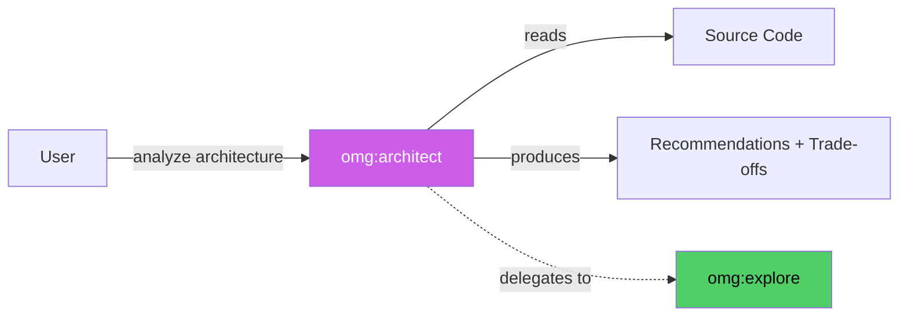

# omg:architect

Review architecture, analyze code structure, diagnose root causes, and provide actionable recommendations.

## Synopsis

```bash
copilot -i "analyze the architecture of src/pipeline/"
copilot -i "what design pattern does this codebase use?"
copilot --agent omg:architect -p "review the auth module design"
```

## Description

The architect agent analyzes code at the structural level. It reads code, identifies patterns, traces dependencies, and provides recommendations — but never modifies files (READ-ONLY).

Use architect when you need to understand **how** code is structured, **why** it was built that way, or **what** to change at the design level.



## Model

`claude-opus-4.6` (reasoning-class — deep analysis requires opus)

## Tools

`view`, `grep`, `glob`, `bash`, `task`

No `edit` or `create` — architect is strictly READ-ONLY.

## When to Use

| Situation | Example |
|-----------|---------|
| Design decisions | "Should we split this into microservices?" |
| Code analysis | "What pattern does the auth module use?" |
| Root cause diagnosis | "Why is the build slow?" |
| Trade-off evaluation | "Pros/cons of adding caching here?" |
| Pre-implementation review | "Is this plan architecturally sound?" |

## When NOT to Use

| Situation | Use instead |
|-----------|------------|
| Need code changes | `omg:executor` |
| Need a plan | `omg:planner` |
| Need security audit | `omg:security-reviewer` |
| Quick file search | `omg:explore` |

## Example

```bash
copilot --agent omg:architect -p "Analyze the architecture of src/pipeline/. What design pattern is used? What are the stages? How do they connect?" -s --yolo
```

**Expected output:**
```
## Architecture Analysis: src/pipeline/

Pattern: **Importers → IR → Pipeline Stages → Exporters**

This follows the Pipes and Filters architectural pattern with an
Intermediate Representation (IR) as the shared data model.

### Stages

| Stage | Input | Output | Purpose |
|-------|-------|--------|---------|
| merge | IR[] | IR | Deduplicate across sources |
| match | IR | IR + matches | TF-IDF cross-source matching |
| enhance | IR | IR + enhancements | Inject Copilot-native improvements |
| validate | IR | IR + validation | Completeness check before export |

### Trade-offs

+ Clean separation: each stage is independently testable
+ IR decouples importers from exporters
- Single-threaded pipeline (no parallel stage execution)
- IR in memory (limits to ~10K agents/skills)
```

## Handoff Contract

After analysis, architect persists findings to `.omg/research/architect-{topic}.md` for downstream agents to consume. Returns structured markdown — the orchestrating skill persists it.

## Related

- `omg:analyst` — finds requirement GAPS (before architect)
- `omg:critic` — evaluates PLANS (after architect)
- `omg:executor` — IMPLEMENTS recommendations
- `omg:explore` — fast codebase SEARCH (architect delegates to explore)

## See Also

- [All agents](../readme.md)
- [Architecture docs](../architecture/plugin.md)
- [Best practices](../../BEST-PRACTICES.md)
