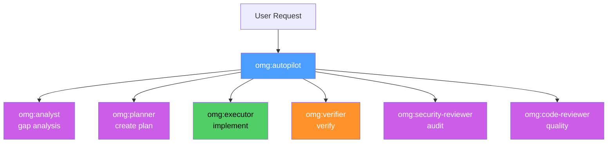

# omg:autopilot

Build something from scratch — takes a task from idea to verified completion.

## Synopsis

```bash
copilot -i "autopilot: build a REST API for user management"
copilot -i "autopilot: add JWT authentication to the API"
copilot --agent omg:autopilot -p "add a --version flag to the CLI" -s --yolo
```

## Description

Autopilot is the primary orchestration agent. It runs the full lifecycle: understand → plan → implement → verify. It does NOT write code directly — it coordinates specialists via `task()`.

Has two modes:
- **Full lifecycle** (default): plan → implement → verify → review
- **Ralph mode** ("ralph", "must complete"): strict implementation loop until all criteria pass



## Model

`claude-sonnet-4.6`

## Tools

`view`, `grep`, `glob`, `task`, `store_memory`, `report_intent`

No `bash`, `edit`, or `create` — autopilot MUST delegate via `task()`.

## When to Use

| Situation | Example |
|-----------|---------|
| New feature from scratch | "autopilot: build a REST API" |
| Complex multi-file change | "autopilot: add authentication" |
| Need verified completion | "autopilot: refactor the pipeline" |
| Don't want to manage steps | "autopilot: handle it all" |

## When NOT to Use

| Situation | Use instead |
|-----------|------------|
| Quick single-file fix | `omg:executor` directly |
| Just need a plan | `plan` skill or `omg:planner` |
| Just exploration | `omg:explore` |
| Strict completion without planning | `ralph` mode |

## Example

```bash
copilot --agent omg:autopilot -p "autopilot: add a --version flag to the CLI" -s --yolo --autopilot
```

**Expected output:**
```
[omg] autopilot: Analyzing requirements
  → exploring codebase for CLI structure
  → found src/cli.ts (entry point)

[omg] autopilot: Creating plan
  → Step 1: Add --version option to commander
  → Step 2: Read version from package.json
  → Step 3: Verify with npm test

[omg] autopilot: Implementing
  → task(omg:executor) modifying src/cli.ts

[omg] autopilot: Verifying
  → npm test: 538 passed
  → build: success

Done. 1 file modified, tests pass.
```

## Ralph Mode

Say "ralph" for strict completion — skips planning/review, just implements → verifies → fixes → repeats:

```bash
copilot -i "ralph: fix all lint errors in src/"
```

## Persistence

| Phase | Path | store_memory key |
|-------|------|-----------------|
| Requirements | `.omg/research/` | `omg:active-spec` |
| Plan | `.omg/plans/` | `omg:active-plan` |
| QA cycles | `.omg/qa-logs/` | — |
| Review | `.omg/reviews/` | `omg:last-review` |

## Quality Contract

- Plans before coding (unless ralph mode)
- Evidence over claims — fresh test output
- Same failure 3x → stops and reports
- Max 5 iterations per story

## Related

- [omg:executor](executor.md) — implements code (autopilot delegates to it)
- [omg:planner](planner.md) — creates plans
- [omg:verifier](verifier.md) — verifies completion
- [team](../skills/team.md) — parallel execution (vs autopilot's sequential)

## See Also

- [All agents](../readme.md)
- [Best practices](../../best-practices.md)
