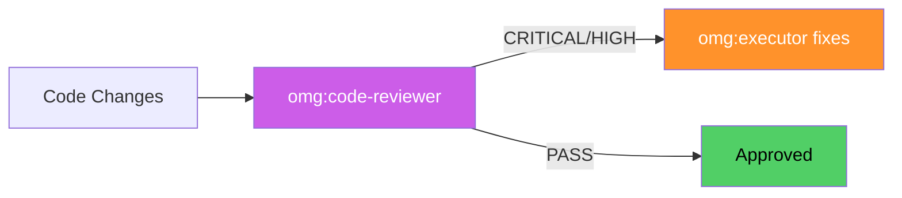

# omg:code-reviewer

Review code for quality, logic defects, security issues, performance problems, and SOLID violations. Use for code reviews, pull request checks, and production readiness audits.

## Synopsis

```bash
copilot --agent omg:code-reviewer -p "describe your role in one sentence" -s --yolo
copilot -i "use omg:code-reviewer to help with this"
```

## Description



Review code for quality, logic defects, security issues, performance problems, and SOLID violations. Use for code reviews, pull request checks, and production readiness audits.

## Model

`claude-opus-4.6`

## Tools

`view,grep,glob,bash,task`

## Example

```bash
copilot --agent omg:code-reviewer -p "describe your role and primary value" -s --yolo
```

## Quality Contract

- Severity-rated: CRITICAL/HIGH/MEDIUM/LOW
- Stage 1 (spec compliance) must pass before Stage 2 (quality)
- Every issue cites file:line with fix suggestion

## Related

See [all agents](../readme.md) for the full catalog.

## See Also

- [All agents](../readme.md)
- [Best practices](../../best-practices.md)
