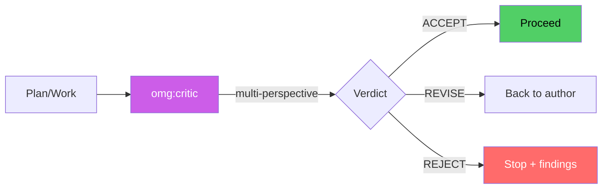

# omg:critic

Evaluate plans, designs, and implementations from multiple perspectives. Final quality gate before execution. Use for plan review, architecture validation, and go/no-go decisions.

## Synopsis

```bash
copilot --agent omg:critic -p "describe your role in one sentence" -s --yolo
copilot -i "use omg:critic to help with this"
```

## Description



Evaluate plans, designs, and implementations from multiple perspectives. Final quality gate before execution. Use for plan review, architecture validation, and go/no-go decisions.

## Model

`claude-opus-4.6`

## Tools

`view,grep,glob,bash,task`

## Example

```bash
copilot --agent omg:critic -p "describe your role and primary value" -s --yolo
```

## Quality Contract

- Pre-commitment predictions before reading work
- Multi-perspective: security, new-hire, ops angles
- Verdicts: REJECT, REVISE, ACCEPT-WITH-RESERVATIONS, ACCEPT

## Related

See [all agents](../readme.md) for the full catalog.

## See Also

- [All agents](../readme.md)
- [Best practices](../../best-practices.md)
