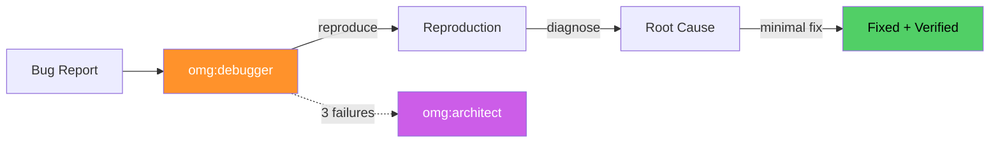

# omg:debugger

Debug and FIX — find the root cause, apply the minimal fix, verify it works. Use when something is broken and needs to be working again.

## Synopsis

```bash
copilot --agent omg:debugger -p "describe your role in one sentence" -s --yolo
copilot -i "use omg:debugger to help with this"
```

## Description



Debug and FIX — find the root cause, apply the minimal fix, verify it works. Use when something is broken and needs to be working again.

## Model

`claude-sonnet-4.6`

## Tools

`view,grep,glob,bash,edit,task`

## Example

```bash
copilot --agent omg:debugger -p "describe your role and primary value" -s --yolo
```

## Quality Contract

- Reproduces BEFORE investigating
- One hypothesis at a time (no bundled fixes)
- After 3 failed hypotheses → escalates to omg:architect

## Related

See [all agents](../readme.md) for the full catalog.

## See Also

- [All agents](../readme.md)
- [Best practices](../../best-practices.md)
