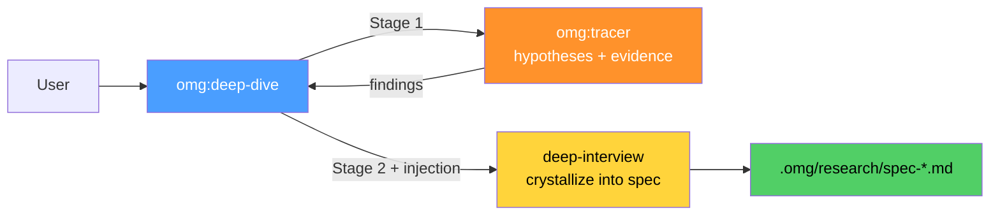

# omg:deep-dive

Investigate a problem then define what to do about it — trace first, then crystallize into a spec.

## Synopsis

```bash
copilot -i "deep-dive: why is the build slow?"
copilot -i "deep-dive: investigate the auth module before refactoring"
copilot --agent omg:deep-dive -p "trace why tests fail then spec the fix" -s --yolo
```

## Description

A two-stage pipeline: first TRACE the root cause (competing hypotheses, evidence ranking), then CRYSTALLIZE findings into an actionable spec via structured interview. The key value is the **injection** — trace findings flow directly into the interview.



## Model

`claude-sonnet-4.6`

## Tools

`view`, `grep`, `glob`, `task`, `store_memory`, `report_intent`

## When to Use

| Situation | Example |
|-----------|---------|
| Don't know the root cause | "deep-dive: why is the build slow?" |
| Need to understand before building | "deep-dive: investigate auth before refactoring" |
| Investigation must lead to a plan | "deep-dive: trace the bug and spec the fix" |

## When NOT to Use

| Situation | Use instead |
|-----------|------------|
| Already know root cause | `deep-interview` directly |
| Just want investigation, no spec | `trace` skill |
| Clear task, ready to execute | `omg:autopilot` |

## Example

```bash
copilot -i "deep-dive: why is the build slow and what should we do about it?"
```

**Expected output:**
```
[omg] deep-dive: Stage 1 — Trace
  Hypothesis 1: Large dependency tree (evidence: 847 packages)
  Hypothesis 2: No build cache (evidence: .cache/ missing)
  Hypothesis 3: TypeScript incremental off (evidence: tsconfig.json)
  
  Best explanation: TypeScript incremental compilation disabled
  Confidence: HIGH (tsconfig shows incremental: false)

[omg] deep-dive: Stage 2 — Crystallize
  Injecting trace findings into interview...
  
  Spec: Enable incremental TypeScript compilation
  - Enable incremental in tsconfig.json
  - Add .tsbuildinfo to .gitignore
  - Expected improvement: 60-80% faster rebuilds
  
  Saved: .omg/research/spec-build-performance.md
```

## Quality Contract

- Trace BEFORE specifying — never write requirements without understanding
- Evidence injection — interview questions reference trace findings
- Actionable output — spec concrete enough for autopilot to execute
- Both stages persisted to `.omg/research/`

## Related

- [omg:tracer](tracer.md) — Stage 1 (investigation only)
- [deep-interview](../skills/deep-interview.md) — Stage 2 (spec only)
- [omg:autopilot](autopilot.md) — executes the resulting spec

## See Also

- [All agents](../readme.md)
