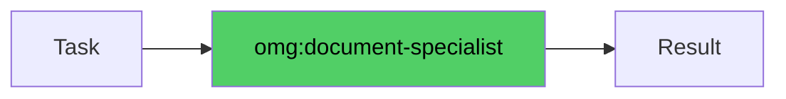

# omg:document-specialist

Look up external documentation, API references, library guides, and version compatibility. Use when you need official docs or framework knowledge.

## Synopsis

```bash
copilot --agent omg:document-specialist -p "describe your role in one sentence" -s --yolo
copilot -i "use omg:document-specialist to help with this"
```

## Description



Look up external documentation, API references, library guides, and version compatibility. Use when you need official docs or framework knowledge.

## Model

`claude-sonnet-4.6`

## Tools

`view,grep,glob,bash,web_fetch,task`

## Example

```bash
copilot --agent omg:document-specialist -p "describe your role and primary value" -s --yolo
```

## Quality Contract

- Official docs preferred over blogs/Stack Overflow
- Version compatibility noted explicitly
- Every answer includes source URLs

## Related

See [all agents](../readme.md) for the full catalog.

## See Also

- [All agents](../readme.md)
- [Best practices](../../best-practices.md)
