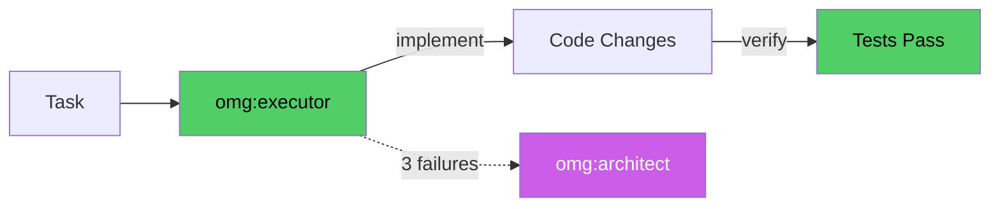

# omg:executor

Implement code changes, write features, fix bugs, and verify with tests. The workhorse agent for any coding task. Use for implementation work of any size.

## Synopsis

```bash
copilot --agent omg:executor -p "describe your role in one sentence" -s --yolo
copilot -i "use omg:executor to help with this"
```

## Description



Implement code changes, write features, fix bugs, and verify with tests. The workhorse agent for any coding task. Use for implementation work of any size.

## Model

`claude-sonnet-4.6`

## Tools

`view,grep,glob,bash,edit,web_fetch,task,ask_user,**Trivial tasks:** skip extensive exploration, verify only modified file.,**Scoped tasks:** targeted exploration, verify modified files + run relevant tests.`

## Example

```bash
copilot --agent omg:executor -p "describe your role and primary value" -s --yolo
```

## Quality Contract

- Smallest viable diff — no scope creep
- Verifies after each change (lint/typecheck on modified files)
- After 3 failed attempts → escalates to omg:architect

## Related

See [all agents](../readme.md) for the full catalog.

## See Also

- [All agents](../readme.md)
- [Best practices](../../best-practices.md)
