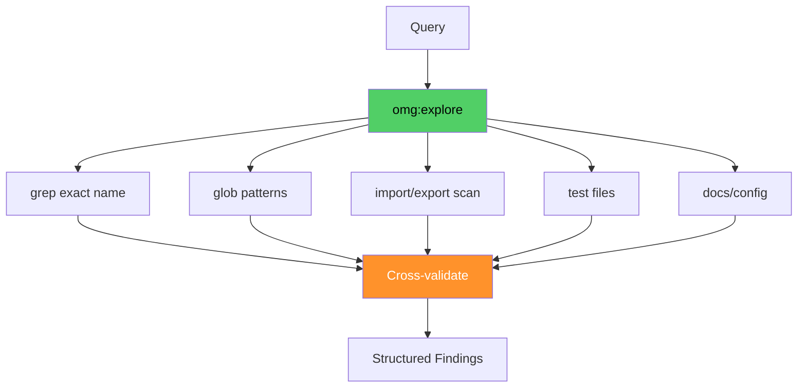

# omg:explore

Search and explore codebases — find files, patterns, dependencies, and relationships. Use when you need to understand or navigate code.

## Synopsis

```bash
copilot --agent omg:explore -p "describe your role in one sentence" -s --yolo
copilot -i "use omg:explore to help with this"
```

## Description



Search and explore codebases — find files, patterns, dependencies, and relationships. Use when you need to understand or navigate code.

## Model

`claude-haiku-4.5`

## Tools

`view,grep,glob,bash`

## Example

```bash
copilot --agent omg:explore -p "describe your role and primary value" -s --yolo
```

## Quality Contract

- Launches 3+ parallel searches from different angles
- Returns ALL absolute paths (not relative)
- Cross-validates findings, caps depth after 2 rounds

## Related

See [all agents](../readme.md) for the full catalog.

## See Also

- [All agents](../readme.md)
- [Best practices](../../best-practices.md)
