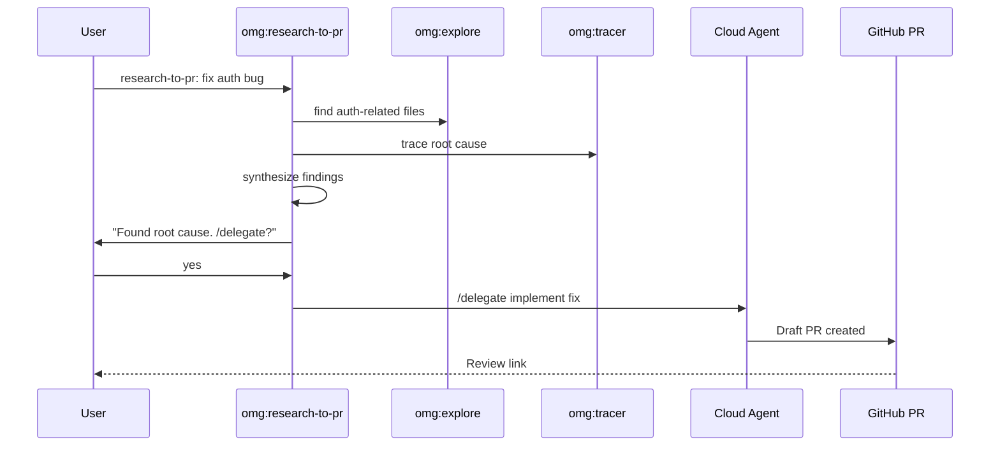

# omg:research-to-pr

Investigate a problem then create a PR automatically — Copilot-exclusive workflow.

## Synopsis

```bash
copilot -i "research-to-pr: fix the auth token expiry bug"
copilot -i "research-to-pr: improve error messages in the CLI"
copilot --agent omg:research-to-pr -p "investigate and fix the login issue" -s --yolo
```

## Description

The flagship omg workflow. Combines three Copilot-exclusive capabilities that no other AI coding tool has:

1. **task subagents** — parallel deep investigation
2. **GitHub MCP** — search issues, PRs, code across repositories
3. **/delegate** — hand off to cloud agent → automatic PR



## Model

`claude-sonnet-4.6`

## Tools

`view`, `grep`, `glob`, `task`, `web_fetch`, `store_memory`, `report_intent`

## When to Use

| Situation | Example |
|-----------|---------|
| Bug needs investigation + PR | "research-to-pr: fix the auth bug" |
| Want a PR without babysitting | "investigate and send a PR" |
| Complex problem needing context | "research why deploys fail and fix it" |

## When NOT to Use

| Situation | Use instead |
|-----------|------------|
| Quick local fix | `omg:executor` |
| Need user input during implementation | `ralph` mode |
| Want to review before PR | `plan` + `executor` locally |

## Example

```bash
copilot -i "research-to-pr: fix the auth token expiry bug"
```

**Expected output:**
```
[omg] research-to-pr: Phase 1 — Research
  → omg:explore finding auth-related files
  → omg:tracer tracing token lifecycle
  → web: checking GitHub issues for related reports

[omg] research-to-pr: Phase 2 — Synthesis
  Root cause: refreshToken() not called on 401 response
  File: src/auth/middleware.ts:45
  Evidence: token expires after 15min, no refresh logic

Want me to /delegate this to create a PR? (y/n)
> yes

[omg] Delegating to cloud agent...
  → Branch: fix/auth-token-refresh
  → PR: https://github.com/you/repo/pull/42
```

## Quality Contract

- Research BEFORE implementing — never fix blindly
- Parallel research (explore + tracer + web simultaneously)
- Findings persisted to `.omg/research/`
- Every finding cites file:line or URL

## Related

- [omg:explore](explore.md) — codebase search (used in Phase 1)
- [omg:tracer](tracer.md) — causal analysis (used in Phase 1)
- [omg:executor](executor.md) — local implementation (alternative to /delegate)

## See Also

- [All agents](../readme.md)
- [/delegate docs](../../best-practices.md)
