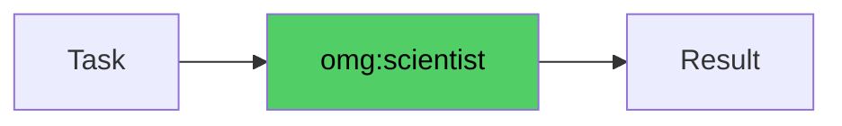

# omg:scientist

Analyze data, test hypotheses, and produce statistically rigorous findings. Use for data investigations, performance analysis, and research questions.

## Synopsis

```bash
copilot --agent omg:scientist -p "describe your role in one sentence" -s --yolo
copilot -i "use omg:scientist to help with this"
```

## Description



Analyze data, test hypotheses, and produce statistically rigorous findings. Use for data investigations, performance analysis, and research questions.

## Model

`claude-sonnet-4.6`

## Tools

`view,grep,glob,bash`

## Example

```bash
copilot --agent omg:scientist -p "describe your role and primary value" -s --yolo
```

## Quality Contract

- Every finding backed by confidence interval + evidence
- Uses matplotlib with Agg backend, saves (never show)
- READ-ONLY on application code

## Related

See [all agents](../readme.md) for the full catalog.

## See Also

- [All agents](../readme.md)
- [Best practices](../../best-practices.md)
