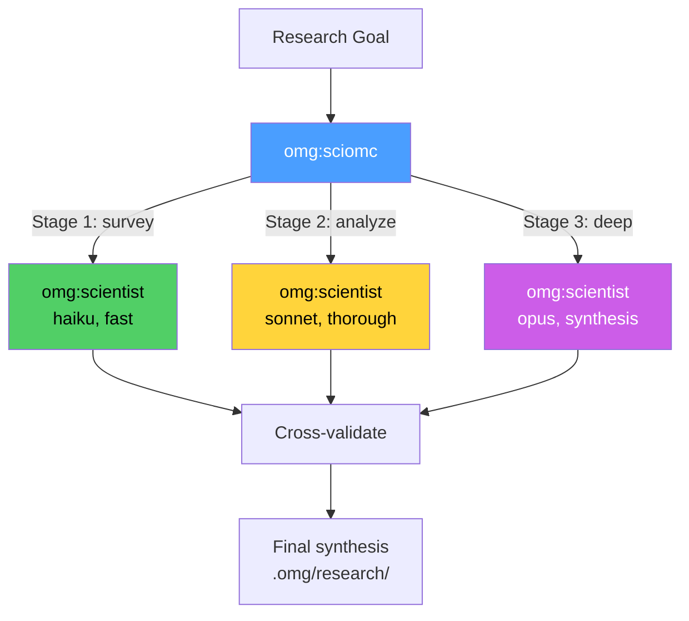

# omg:sciomc

Research a complex question from multiple angles in parallel.

## Synopsis

```bash
copilot -i "sciomc: analyze test coverage patterns across the codebase"
copilot -i "sciomc: research caching strategies for our API"
copilot --agent omg:sciomc -p "investigate performance bottlenecks" -s --yolo
```

## Description

Decomposes a research goal into 3-7 investigation stages and executes them with tiered scientist agents. Quick survey with haiku, deeper analysis with sonnet, synthesis with opus. Cross-validates findings across stages.



## Model

`claude-sonnet-4.6`

## When to Use

| Situation | Example |
|-----------|---------|
| Complex research, multiple angles | "sciomc: analyze performance patterns" |
| Need statistical rigor | "sciomc: compare caching strategies" |
| Comprehensive codebase analysis | "sciomc: test coverage analysis" |

## When NOT to Use

| Situation | Use instead |
|-----------|------------|
| Quick lookup | `omg:explore` |
| External docs | `external-context` skill |
| Root cause analysis | `trace` skill |

## Example

```bash
copilot -i "sciomc: analyze test coverage patterns across the codebase"
```

**Expected output:**
```
[omg] sciomc: decomposing into 3 stages
  → Stage 1 (haiku): survey test file distribution
  → Stage 2 (sonnet): analyze coverage gaps per module
  → Stage 3 (opus): synthesize recommendations

[omg] sciomc: Stage 1 complete — 44 test files, 538 tests
[omg] sciomc: Stage 2 complete — 3 modules under-tested
[omg] sciomc: Stage 3 — cross-validating and synthesizing

Findings:
- src/importers/: 85% coverage (good)
- src/exporters/: 72% coverage (3 gap areas)
- src/pipeline/: 91% coverage (excellent)

Saved: .omg/research/sciomc-test-coverage.md
```

## Quality Contract

- Statistical rigor — findings backed by evidence
- Multi-angle — at least 3 independent investigation stages
- Cross-validation — findings confirmed across stages rank higher
- Tiered models — haiku for surveys, opus for synthesis

## Related

- [omg:scientist](scientist.md) — individual research agent (sciomc orchestrates multiple)
- [omg:explore](explore.md) — fast search (sciomc is deeper)
- [deep-analyze](../skills/deep-analyze.md) — multi-agent analysis skill

## See Also

- [All agents](../readme.md)
