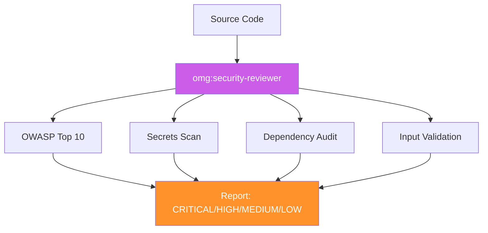

# omg:security-reviewer

Audit code for security vulnerabilities, exposed secrets, dependency risks, and OWASP Top 10 issues. Use for security reviews, production readiness checks, and compliance audits.

## Synopsis

```bash
copilot --agent omg:security-reviewer -p "describe your role in one sentence" -s --yolo
copilot -i "use omg:security-reviewer to help with this"
```

## Description



Audit code for security vulnerabilities, exposed secrets, dependency risks, and OWASP Top 10 issues. Use for security reviews, production readiness checks, and compliance audits.

## Model

`claude-opus-4.6`

## Tools

`view,grep,glob,bash,task`

## Example

```bash
copilot --agent omg:security-reviewer -p "describe your role and primary value" -s --yolo
```

## Quality Contract

- OWASP Top 10 evaluated
- Severity: CRITICAL (data breach), HIGH, MEDIUM, LOW
- Remediation code in the project's language

## Related

See [all agents](../readme.md) for the full catalog.

## See Also

- [All agents](../readme.md)
- [Best practices](../../best-practices.md)
