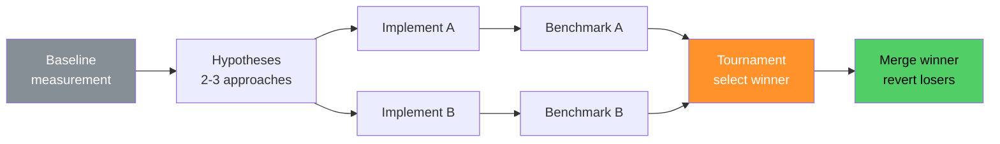

# omg:self-improve

Optimize code by testing competing approaches — benchmark each, keep the winner.

## Synopsis

```bash
copilot -i "self-improve: optimize pipeline performance"
copilot -i "self-improve: reduce bundle size"
copilot --agent omg:self-improve -p "improve test execution speed" -s --yolo
```

## Description

An autonomous optimization engine. Captures a baseline, generates competing improvement hypotheses, implements each, benchmarks, and tournament-selects the winner. Only measurable improvements survive.



## Model

`claude-sonnet-4.6`

## When to Use

| Situation | Example |
|-----------|---------|
| Need measurable improvement | "self-improve: optimize build speed" |
| Multiple approaches possible | "self-improve: reduce memory usage" |
| Want data-driven decisions | "self-improve: improve test performance" |

## When NOT to Use

| Situation | Use instead |
|-----------|------------|
| Single targeted fix | `omg:executor` |
| Need to understand first | `deep-dive` or `trace` |
| No benchmark available | Define a metric first |

## Example

```bash
copilot -i "self-improve: optimize pipeline execution speed"
```

**Expected output:**
```
[omg] self-improve: capturing baseline
  → npm test: 2.4s average

[omg] self-improve: generating hypotheses
  → A: parallelize independent pipeline stages
  → B: add memoization to TF-IDF calculations

[omg] self-improve: implementing + benchmarking
  → A: 1.8s (25% improvement)
  → B: 2.1s (12% improvement)

[omg] self-improve: tournament result
  Winner: A (parallelize stages) — 25% faster
  Reverting B, merging A.

Saved: .omg/research/self-improve/history/
```

## Quality Contract

- Measure, don't guess — every claim has a benchmark number
- Competing strategies — at least 2 approaches per iteration
- Revert losers — only winning changes survive
- Respect constraints — sealed files not modified

## Related

- [omg:architect](architect.md) — generates hypotheses
- [omg:executor](executor.md) — implements each approach
- [omg:git-master](git-master.md) — merges winning changes

## See Also

- [All agents](../readme.md)
