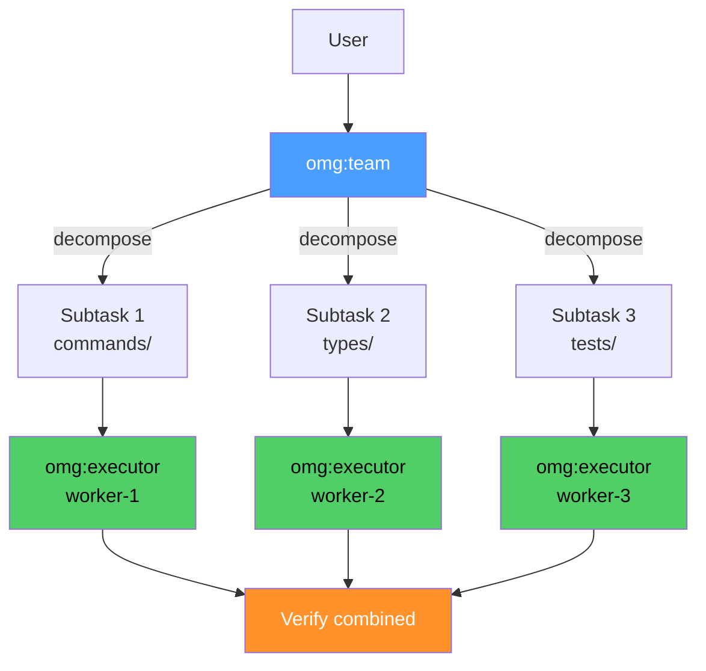

# omg:team

Split work across parallel agents — decomposes tasks and coordinates multiple workers simultaneously.

## Synopsis

```bash
copilot -i "team 3: fix TypeScript errors across src/"
copilot -i "team 5: add JSDoc to all mapping files"
copilot --agent omg:team -p "team: add tests for all commands" -s --yolo
```

## Description

Team decomposes a large task into independent subtasks and fires multiple workers in parallel. Each worker gets explicit file boundaries to prevent conflicts. After all complete, team verifies the combined result.

Also handles "ultrawork" (simple parallel fire without decomposition).



## Model

`claude-sonnet-4.6`

## Tools

`view`, `grep`, `glob`, `task`, `store_memory`, `report_intent`

No `bash`, `edit` — team delegates ALL work via `task()`.

## When to Use

| Situation | Example |
|-----------|---------|
| Multiple independent files | "team 3: add tests for src/" |
| Parallelizable work | "team: fix errors across all modules" |
| Need speed | "ulw: search for TODO in all files" |

## When NOT to Use

| Situation | Use instead |
|-----------|------------|
| Sequential dependencies | `omg:autopilot` |
| Single file | `omg:executor` directly |
| Need verification loop | `ralph` mode |

## Example

```bash
copilot --agent omg:team -p "team 3: add JSDoc to src/mappings/omc-tool-names.ts, omc-model-names.ts, omc-event-names.ts" -s --yolo --autopilot
```

**Expected output:**
```
[omg] team: 3 workers dispatched
  → worker-1 (sonnet, bg) — omc-tool-names.ts
  → worker-2 (sonnet, bg) — omc-model-names.ts
  → worker-3 (sonnet, bg) — omc-event-names.ts

[omg] team: collecting results
  → worker-1: complete (4 functions documented)
  → worker-2: complete (3 functions documented)
  → worker-3: complete (5 functions documented)

[omg] team: verifying combined result
  → npm test: pass
  → no conflicts detected

Done. 3 files modified by 3 parallel workers.
```

## Quality Contract

- Parallel, not sequential — never serialize independent work
- File isolation per worker — no overlap
- Combined verification after all workers
- Conflict resolution if two workers touch same file

## Related

- [omg:autopilot](autopilot.md) — sequential lifecycle (vs team's parallel)
- [omg:executor](executor.md) — individual worker agent
- [ultrawork](../skills/ultrawork.md) — alias for team parallel mode

## See Also

- [All agents](../readme.md)
