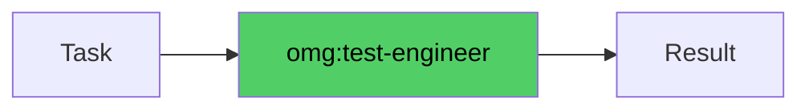

# omg:test-engineer

Write tests, design test strategies, fix flaky tests, and improve coverage. Use for TDD, adding missing tests, and test infrastructure work.

## Synopsis

```bash
copilot --agent omg:test-engineer -p "describe your role in one sentence" -s --yolo
copilot -i "use omg:test-engineer to help with this"
```

## Description



Write tests, design test strategies, fix flaky tests, and improve coverage. Use for TDD, adding missing tests, and test infrastructure work.

## Model

`claude-sonnet-4.6`

## Tools

`view,grep,glob,bash,edit,task`

## Example

```bash
copilot --agent omg:test-engineer -p "describe your role and primary value" -s --yolo
```

## Quality Contract

- THE IRON LAW: no production code without failing test first
- Testing pyramid: 70% unit, 20% integration, 10% e2e
- Flaky test root cause identified (timing, shared state, env)

## Related

See [all agents](../readme.md) for the full catalog.

## See Also

- [All agents](../readme.md)
- [Best practices](../../best-practices.md)
