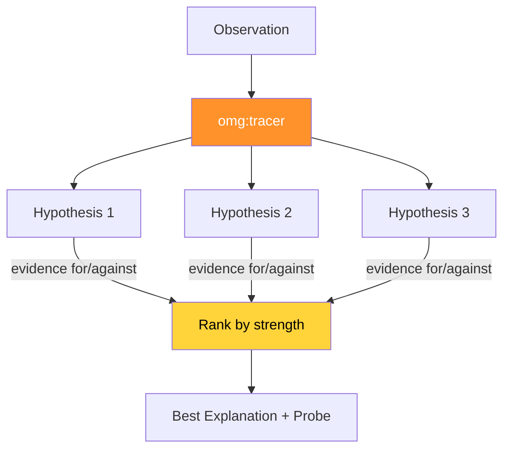

# omg:tracer

Investigate WHY without fixing — generate competing hypotheses, rank by evidence, recommend next probe. Use when you need to UNDERSTAND a problem, not fix it yet.

## Synopsis

```bash
copilot --agent omg:tracer -p "describe your role in one sentence" -s --yolo
copilot -i "use omg:tracer to help with this"
```

## Description



Investigate WHY without fixing — generate competing hypotheses, rank by evidence, recommend next probe. Use when you need to UNDERSTAND a problem, not fix it yet.

## Model

`claude-sonnet-4.6`

## Tools

`view,grep,glob,bash`

## Example

```bash
copilot --agent omg:tracer -p "describe your role and primary value" -s --yolo
```

## Quality Contract

- At least 2 competing hypotheses
- Evidence ranked by strength (reproduction > inference > speculation)
- Pre-mortem on best explanation: assume it's wrong

## Related

See [all agents](../readme.md) for the full catalog.

## See Also

- [All agents](../readme.md)
- [Best practices](../../best-practices.md)
