# omg Architecture

## Identity

**omg (Oh My GitHub Copilot)** is the orchestrator for GitHub Copilot — the Copilot equivalent of oh-my-claudecode (OMC) for Claude Code. It is a multi-source aggregator and enhancer, not a translator or a marketplace.

omg pulls agents, skills, hooks, instructions, and MCP server configs from multiple sources (OMC, Microsoft Skills, community), normalizes them into a platform-agnostic Intermediate Representation, runs them through an enhancement pipeline, and exports them as a native Copilot Plugin that can be installed with `copilot plugin install ./`.

## Design Philosophy

1. **Copilot-Native-First** — Only generate files and formats that GitHub Copilot natively supports. If a source feature has no Copilot equivalent, it's cleanly dropped and documented — never hacked into place.
2. **All Sources Are Equal Citizens** — OMC, Microsoft Skills, awesome-copilot, and Copilot-native inputs all flow through the same pipeline. No source gets special treatment. Priority is configurable, not hard-coded.
3. **Data-Driven, Not Hard-Coded** — Model catalogs, scoring signals, tool mappings, and event tables are declarative data structures. Adding support for a new model or mapping is adding a row, not changing an algorithm.
4. **Plugin Format as Universal Output** — Every export produces a `plugin.json` manifest. All generated artifacts are installable as a single unit via the Copilot CLI plugin system.

## CLI Commands

`src/cli.ts` is a 19-line thin wiring layer that registers 11 commands from `src/commands/*.ts` and calls `program.parse()`.

### Orchestrator Commands

| Command | Description |
|---------|-------------|
| `omg init` | Initialize omg in the current project: detect tier + packages, write `.omg.json` |
| `omg add <package>` | Fetch a package, run it through the pipeline, write Copilot files, update `.omg.json` |
| `omg sync` | Re-fetch and update all packages configured in `.omg.json` (delegates to `omg add` per source) |
| ~~`omg serve`~~ | ~~Removed — MCP server was redundant (Copilot-native `store_memory` + `.omg/` files cover all use cases)~~ |
| `omg status` | Show current setup HUD: packages, tier, agent/skill counts, plugin install status |

### Core Commands

| Command | Description |
|---------|-------------|
| `omg translate <src> <out>` | Full pipeline: import → merge → match → enhance → validate → export |
| `omg validate <out>` | Validate exported output against Copilot JSON schemas |
| `omg report <src>` | Generate translation report: what was translated, dropped, and enhanced |
| `omg registry list` | List all available packages with descriptions |
| `omg test` | Run behavioral test suite against a Copilot CLI session |

## Pipeline Overview

```mermaid
graph TB
    subgraph Importers["IMPORTERS (parallel)"]
        OMC["OMC<br/>6 sub-modules:<br/>agents, skills, hooks,<br/>instructions, rules, mcp"]
        MS["Microsoft Skills<br/>6 official repos:<br/>skills, azure-skills,<br/>fabric, copilot-studio,<br/>azure-devops, power-platform"]
        AC["awesome-copilot<br/>Community index<br/>~271 skills from<br/>README.md parse"]
        CN["copilot-native<br/>Pass-through for<br/>existing .agent.md"]
    end

    Importers -->|"ImportResult[]"| MERGE

    subgraph Pipeline["PIPELINE STAGES"]
        MERGE["1. MERGE<br/>Dedup by ID, source priority,<br/>MCP config union"]
        MATCH["2. MATCH<br/>TF-IDF cosine similarity<br/>(agents ↔ skills)<br/>Tag boost, confidence thresholds"]
        ENHANCE["3. ENHANCE<br/>tmux → /fleet replacement<br/>Handoff injection (task delegation)<br/>Model selection (tier-aware scoring)"]
        VALIDATE["4. VALIDATE<br/>IR completeness check<br/>Agent names, instructions, handoff targets<br/>Hook event membership"]

        MERGE --> MATCH --> ENHANCE --> VALIDATE
    end

    VALIDATE --> Exporters

    subgraph Exporters["EXPORTERS (parallel)"]
        CLI["Copilot CLI (default)<br/>plugin.json<br/>agents/*.agent.md<br/>skills/*/SKILL.md<br/>hooks.json<br/>copilot-instructions.md<br/>instructions/*.md<br/>.copilot/mcp-config.json"]
        VSC["VS Code Agent Mode<br/>Extends CLI with<br/>3 extra hook events"]
        SDK["Copilot SDK<br/>SessionConfig adapter<br/>for programmatic sessions"]
    end

    Exporters --> TEST

    subgraph TEST["TEST (optional)"]
        T1["omg test — Behavioral testing via Copilot CLI<br/>YAML test definitions → copilot -p --agent<br/>Validates responses against assertions"]
    end
```



## Output Format: Native Copilot Plugin

Every `omg translate` or `omg add` run produces a Copilot Plugin — a directory installable with `copilot plugin install ./`.

| File | Description |
|------|-------------|
| `plugin.json` | Plugin manifest: name, version, agent/skill/hook paths |
| `.github/agents/*.agent.md` | Agent definitions with YAML frontmatter (name, description, model, tools) + Markdown instructions body |
| `.github/skills/*/SKILL.md` | Skills auto-discovered by Copilot via directory structure |
| `.github/hooks/hooks.json` | Lifecycle hooks in `version:1, event-keyed` format |
| `.github/copilot-instructions.md` | Primary instructions injected into all sessions |
| `.github/instructions/*.instructions.md` | Contextual rules with `applyTo` glob patterns |
| `.copilot/mcp-config.json` | MCP server configuration (merged, never overwritten) |

### Agent Frontmatter Requirements

Agent `.agent.md` files require `name` and `description` in YAML frontmatter:

```yaml
---
name: architect
description: Reviews architecture and technical decisions
model: claude-opus-4-6
tools: [view, grep, glob, bash, task]
---
```

The instructions body follows as Markdown. Agent-to-agent delegation uses Copilot's native `task` tool to spawn subagents — no custom dispatch layer. See `plugin/ARCHITECTURE.md` for the full tool access model.

### hooks.json Format

Copilot uses a `version:1` event-keyed format (not an array):

```json
{
  "version": 1,
  "hooks": {
    "sessionStart": [{ "command": "npx omg sync --dry-run" }],
    "preToolUse": [{ "command": "echo pre-tool" }]
  }
}
```

### MCP Config Merging

`.copilot/mcp-config.json` is **merged**, not overwritten. On every `omg add` run, existing third-party MCP servers are preserved, and generated servers are layered on top.

## Intermediate Representation (IR)

The IR is the contract between importers and exporters. It defines 5 normalized types plus a `NormalizedEvent` enum. All types carry a `SourceRef` for provenance tracking.

### SourceRef

Every IR element tracks its origin:

```typescript
interface SourceRef {
  provider: string;   // "omc", "microsoft/skills-for-fabric", "awesome-copilot"
  repo?: string;      // "microsoft/skills-for-fabric"
  path: string;       // "skills/fabric-lakehouse/SKILL.md"
  commitSha?: string; // For reproducible builds
}
```

### AgentDef

A normalized agent definition. Agents are the primary unit of work — specialized AI assistants with specific tools, instructions, and constraints.

| Field | Type | Description |
|-------|------|-------------|
| `id` | `string` | Unique slug: `"omc/architect"`, `"microsoft/fabric-analyst"` |
| `source` | `SourceRef` | Where this agent came from |
| `name` | `string` | Display name (shown in Copilot autocomplete) |
| `description` | `string` | Short description for Copilot sidebar |
| `tools` | `string[]` | Normalized tool IDs — exporters map to platform aliases |
| `model` | `string?` | Model ID, e.g. `"claude-opus-4-6"` (dash format in IR, dot format in export) |
| `instructions` | `string` | Full Markdown body — the agent's system prompt |
| `tags` | `string[]` | Used for TF-IDF matching and categorization |
| `dependencies` | `Dependency[]` | Required MCP servers, tools, or other agents |
| `handoffs` | `string[]?` | Agent IDs for delegation chains (exported as `task` delegation guides) |
| `metadata` | `Record<string, unknown>` | Source-specific extras (level, pipeline steps, disallowedTools) |

### SkillDef

A normalized skill. Skills are invocable units of behavior — smaller than agents, often scoped to a single capability.

| Field | Type | Description |
|-------|------|-------------|
| `id` | `string` | Unique slug: `"microsoft/fabric-lakehouse"` |
| `source` | `SourceRef` | Provenance |
| `name` | `string` | Display name |
| `description` | `string` | Short description — Copilot auto-discovers skills via this field |
| `instructions` | `string` | Markdown body |
| `triggers` | `string[]?` | Activation keywords (deprecated: Copilot auto-discovers by description) |
| `tags` | `string[]` | For matching and categorization |
| `dependencies` | `Dependency[]` | Required tools or MCP servers |
| `metadata` | `Record<string, unknown>` | Source-specific extras |

> **Keyword routing demoted**: omg no longer generates a keyword-routing instructions file. Copilot auto-discovers skills from their SKILL.md description — the `triggers` field in IR is preserved for provenance but not exported as a routing table.

### HookDef

A normalized lifecycle event handler. The `translatable` flag is the key field — exporters skip non-translatable hooks rather than hack them into place.

| Field | Type | Description |
|-------|------|-------------|
| `event` | `NormalizedEvent` | Platform-agnostic event (27 total, 5-8 translatable) |
| `translatable` | `boolean` | `true` = export; `false` = document in report only |
| `handler` | `{ type, command?, scriptPath? }` | Shell command or script reference |

### InstructionDef

Normalized instruction content. Maps to `copilot-instructions.md` (primary) or `.github/instructions/*.instructions.md` (contextual/rule).

| Field | Type | Description |
|-------|------|-------------|
| `type` | `'primary' \| 'contextual' \| 'rule'` | Determines output file location |
| `content` | `string` | Markdown body |
| `applyTo` | `string[]?` | Glob patterns (e.g., `["**/*.sql"]` for SQL-specific rules) |

### McpConfigDef

Normalized MCP server configuration. Multiple sources can contribute servers; the merge stage combines them.

| Field | Type | Description |
|-------|------|-------------|
| `servers` | `Record<string, { command, args?, env? }>` | Named server definitions |

## Pipeline Stages in Detail

### 1. Merge

**Purpose:** Deduplicate across sources when multiple importers produce elements with the same ID.

**Source priority** (lower number = higher priority):

| Priority | Source | Example |
|----------|--------|---------|
| 0 | OMC | `omc/architect` |
| 1 | Copilot-native | Already-compatible `.agent.md` files |
| 2 | microsoft/skills, microsoft/azure-skills | General + Azure skills |
| 3 | microsoft/skills-for-fabric, copilot-studio, azure-devops | Domain-specific skills |
| 4 | awesome-copilot | Community index |

When two sources define the same agent/skill ID, the higher-priority source wins. MCP configs are merged additively — first source to define a server name wins.

### 2. Match (TF-IDF Cross-Source Matching)

**Purpose:** Link skills to agents using semantic similarity, so exporters can embed relevant skills.

**Algorithm:**

1. **Tokenize** each agent and skill: `name + description + tags + instructions[:500]` → lowercase, strip punctuation, filter tokens < 3 chars
2. **TF-IDF vectorize**: Term frequency normalized by document length, IDF as `log(N/df)`
3. **Cosine similarity**: Score each agent↔skill pair
4. **Tag boost**: +0.05 per shared tag (capped at 1.0)
5. **Confidence thresholds**: ≥0.8 = auto-integrate, 0.5-0.79 = suggested, <0.5 = discarded
6. **Overrides**: Force/block pairs from JSON override file

### 3. Enhance

**Purpose:** Apply Copilot-native improvements that go beyond simple format conversion.

Three enhancement passes (keyword routing removed — see SkillDef note above):

| Pass | What it does | Example |
|------|-------------|---------|
| **Handoff injection** | Populates `agent.handoffs[]` from pipeline metadata; exports as delegation guides with `task` tool | `handoffs: ["executor"]` → Delegation Guide table with `task(agent_type=...)` |
| **tmux → /fleet** | Replaces tmux orchestration with Copilot's `/fleet` | `tmux split-window` → `/fleet parallel dispatch` |
| **Model selection** | Assigns optimal Copilot model based on agent complexity and subscription tier | `architect (level 3, read-only)` → `claude-opus-4.6` on Business tier |

#### Agent-to-Agent Delegation

Agents declare handoffs in the IR `handoffs[]` array. The enhance stage auto-injects delegation sections into agent instructions using Copilot's native `task` tool — no custom dispatch, no shell scripts.

```markdown
## Delegation Guide

| Need | Agent | Model Hint | Mode |
|------|-------|-----------|------|
| Implementation | `omg:executor` | sonnet | background |
| Debugging | `omg:debugger` | sonnet | sync |
| Architecture review | `omg:architect` | opus | sync |
```

The delegation graph can be bidirectional: `architect ↔ executor ↔ debugger`. Each agent decides when to hand off based on its instructions. Subagents spawned via `task` have full CLI tool access (`bash`, `view`, `edit`, `grep`, `glob`).

See [PLUGINS-AND-AGENTS.md](PLUGINS-AND-AGENTS.md) for the full delegation guide.

#### Model Selection Algorithm

When `--tier` is specified, each agent is scored across 4 dimensions using a data-driven signal table:

```mermaid
graph LR
    subgraph Signals["Agent Signals"]
        S1["metadata.level: 3"]
        S2["disallowedTools: Edit"]
        S3["tags: [architecture]"]
        S4["instructions: 'review'"]
    end

    subgraph Scoring["Complexity Score"]
        SC["reasoning: 5<br/>coding: 3<br/>speed: 2<br/>context: small"]
    end

    subgraph Catalog["Model Catalog (8 models)"]
        M1["claude-opus-4-6 (reasoning=5)"]
        M2["claude-sonnet-4-6 (reasoning=4)"]
        M3["gpt-4.1 (coding=5)"]
        M4["o3 (reasoning=5)"]
        M5["...4 more"]
    end

    Signals -->|"9 scoring signals"| Scoring
    Scoring -->|"0.4×reasoning + 0.3×coding<br/>+ 0.2×speed + 0.1×context"| Catalog
    Catalog -->|"Best match<br/>filtered by tier"| RESULT["Selected: claude-opus-4-6<br/>Fallbacks: o3, claude-sonnet-4-6"]
```



Scoring formula: `0.4×min(model.reasoning, need) + 0.3×min(model.coding, need) + 0.2×min(model.speed, need) + 0.1×contextBonus`

Models are filtered by subscription tier (Individual, Business, Enterprise) before scoring. If no models pass the filter, the full catalog is used with a warning.

**Strategy modes:**
- `auto-only` (default): Only assigns models to agents that don't already have one
- `override-all`: Reassigns all agents regardless of source model

### 4. Validate

**Purpose:** Catch IR problems before they reach the exporter.

| Check | Severity | Blocks export? |
|-------|----------|---------------|
| Agent missing name | Error | Yes |
| Agent missing instructions | Error | Yes |
| Handoff target doesn't exist | Warning | No |
| Hook event not in NormalizedEvent enum | Error | Yes |
| Skill missing instructions | Warning | No |
| Instruction empty content | Warning | No |

## Configuration (`.omg.json`)

`.omg.json` is the per-project configuration file, written by `omg init` and updated by `omg add`.

```json
{
  "tier": "business",
  "modelStrategy": "auto-only",
  "sources": ["omc", "fabric"],
  "target": "cli",
  "outputDir": ".",
  "mcpServers": { "obs": false },
  "byok": { "provider": "anthropic", "envVar": "ANTHROPIC_API_KEY" }
}
```

| Field | Type | Default | Description |
|-------|------|---------|-------------|
| `tier` | `individual \| business \| enterprise` | unset | Copilot subscription tier — controls model selection |
| `modelStrategy` | `auto-only \| override-all` | `auto-only` | When to assign models |
| `sources` | `string[]` | `["omc"]` | Package shortcut names |
| `target` | `cli \| vscode \| both` | `cli` | Export format |
| `outputDir` | `string` | `.` | Where to write generated files |
| `mcpServers` | `Record<string, boolean>` | `{}` | Enable/disable specific MCP servers |
| `byok` | `{ provider, envVar? }` | unset | Bring Your Own Key — bypasses Copilot subscription |

**Resolution order:** CLI flags > `.omg.json` > defaults (enforced by `resolveConfig()` in `src/config.ts`).

## Package System

`omg add <shortcut>` maps a human-friendly name to a source in `sources.json`, fetches it, runs the pipeline, and writes Copilot files. Packages are defined in `src/registry/packages.ts`.

| Shortcut | Source | Description |
|----------|--------|-------------|
| `omc` | oh-my-claudecode | OMC agents, skills, hooks (19 agents, 36+ skills) |
| `azure` | microsoft/skills | Core Microsoft Copilot skills (~132 skills) |
| `azure-sql` | microsoft/azure-skills | Azure-specific skills + 200 MCP tools |
| `fabric` | microsoft/skills-for-fabric | Microsoft Fabric skills (~9 skills + MCP) |
| `devops` | microsoft/azure-devops-skills | Azure DevOps skills (5 skills) |
| `power-platform` | microsoft/power-platform-skills | Power Platform bundles (4 bundles) |
| `copilot-studio` | microsoft/skills-for-copilot-studio | Copilot Studio skills (4 skills) |
| `community` | github/awesome-copilot | Community skill index (~271 skills, meta-index) |

`omg add` flow:
1. Resolve shortcut → `sourceId` → `SourceConfig` from `sources.json`
2. Fetch via GitHub API → temp directory (with 3-retry rate limit handling)
3. Run pipeline (import → merge → match → enhance → validate → export)
4. Atomic write: path traversal protection, deduplicate across exporters
5. Merge `.copilot/mcp-config.json` with existing third-party MCP servers
6. Update `.omg.json` `sources[]`

## Persistence (`.omg/` Directory)

> The MCP server (`omg serve`) was removed — Copilot-native `store_memory` + `.omg/` files cover all persistence use cases. Code is preserved in git history. MCP config export (`.copilot/mcp-config.json`) is still supported for third-party MCP servers.

Cross-session state is managed via the `.omg/` directory convention and Copilot's `store_memory`:

| Directory | Purpose | Producers | Consumers |
|-----------|---------|-----------|-----------|
| `.omg/plans/` | Work plans with acceptance criteria | planner | autopilot, ralph, team, verifier |
| `.omg/research/` | Analysis output, specs, findings | analyst, architect, explore, tracer | planner, executor, autopilot |
| `.omg/reviews/` | Review verdicts, critique feedback | critic, code-reviewer, security-reviewer, verifier | planner, executor |
| `.omg/qa-logs/` | Iteration state for cyclical workflows | ultraqa, autopilot, ralph | Same skills (next iteration) |

See `plugin/skills/handoff-protocol/SKILL.md` for the full persistence protocol.

## Copilot SDK Integration

The SDK exporter (`src/exporters/copilot-sdk/`) bridges omg's IR and the `@github/copilot-sdk@0.2.1` programmatic API. This enables embedding omg-configured agents into automation workflows, CI pipelines, and custom tools.

### `toSdkSessionConfig(ir, options)`

Converts `PipelineOutput` to a Copilot SDK `SessionConfig`:

- Agents → `customAgents[]` with `infer: true`, tool aliases mapped, models in dot format
- Skills → `skillDirectories[]` with base path resolution
- MCP configs → `mcpServers{}` with `type: 'local'`, `tools: ['*']`
- BYOK: when `options.byokProvider` is set, model IDs use provider-native format

### `createOmgSession(options)`

One function to create a fully configured SDK session:

```typescript
import { createOmgSession } from '@mfalland/omg/sdk';

const { client, session } = await createOmgSession({
  ir: pipelineResult.output,
  agent: 'architect',
  autoApprove: true,
});

const response = await session.sendAndWait('Review the architecture');
```

Handles: agents, skills, MCP servers, hooks (mapped to SDK callbacks), instructions (injected as system prompt section), infinite sessions (context compaction), permissions.

See [SDK-GUIDE.md](SDK-GUIDE.md) for the full SDK integration guide.

## Microsoft Skills Integration

omg integrates all of Microsoft's official GitHub Copilot skill repositories. Each repo is polled on a tiered schedule by the CI monitor workflow.

### Tier 1 — Core Skills (polled every 6 hours)

| Repository | Content |
|------------|---------|
| [microsoft/skills](https://github.com/microsoft/skills) | General-purpose Copilot skills (~132) |
| [microsoft/azure-skills](https://github.com/microsoft/azure-skills) | Azure-specific skills + 200 MCP tools |

### Tier 2 — Domain Skills (polled every 12 hours)

| Repository | Content |
|------------|---------|
| [microsoft/skills-for-fabric](https://github.com/microsoft/skills-for-fabric) | Microsoft Fabric — Lakehouse, Dataflows, Pipelines, KQL (~9) |
| [microsoft/skills-for-copilot-studio](https://github.com/microsoft/skills-for-copilot-studio) | Copilot Studio integration (4) |
| [microsoft/azure-devops-skills](https://github.com/microsoft/azure-devops-skills) | Azure DevOps pipelines and boards (5) |

### Tier 3 — Extended Ecosystem (polled every 24 hours)

| Repository | Content |
|------------|---------|
| [microsoft/power-platform-skills](https://github.com/microsoft/power-platform-skills) | Power Apps, Power Automate, Power BI (4 bundles) |
| [github/awesome-copilot](https://github.com/github/awesome-copilot) | Community-curated skill index (~271, meta-index) |

### Import Flow

```
GitHub API (Octokit)
  │
  ├── getLatestCommitSha() — Get default branch HEAD
  ├── fetchTree() — Recursive tree listing
  ├── isSkillFile() — Filter: SKILL.md, .agent.md, MCP JSON
  └── fetchFileContent() — Base64 decode blob content
         │
         ▼
  gray-matter parse (YAML frontmatter + Markdown body)
         │
         ▼
  SkillDef[] / McpConfigDef[] → into IR pipeline
```

Each repo is tracked via a lockfile (`.omg-skills.lock`) storing the latest commit SHA. The monitor workflow only creates a PR when the SHA changes.

## Hook Event Mapping

OMC defines 27 lifecycle events. Copilot CLI supports 5, VS Code supports 8. The `NormalizedEvent` enum covers all 27; the `translatable` flag on each `HookDef` determines whether it reaches the output.

| Event | Copilot CLI | VS Code | Translatable |
|-------|-------------|---------|-------------|
| session_start | sessionStart | sessionStart | Yes |
| session_end | sessionEnd | sessionEnd | Yes |
| user_prompt_submit | userPromptSubmitted | userPromptSubmitted | Yes |
| pre_tool_use | preToolUse | preToolUse | Yes |
| post_tool_use | postToolUse | postToolUse | Yes |
| subagent_start | — | subagentStart | VS Code only |
| subagent_stop | — | subagentStop | VS Code only |
| error | — | errorOccurred | VS Code only |
| pre_compact, post_compact | — | — | No |
| file_changed, cwd_changed | — | — | No |
| worktree_create/remove | — | — | No |
| notification | — | — | No |
| 10 more OMC-specific events | — | — | No |

**Semantic gap: 27 → 5/8.** omg handles this by cleanly dropping untranslatable hooks and documenting them in the translation report, including suggested Copilot-native alternatives where applicable.

## Tool Name Mapping

Each platform uses different names for the same capabilities:

| Capability | OMC (Claude Code) | IR (Normalized) | Copilot CLI (actual) |
|-----------|-------------------|-----------------|---------------------|
| Read files | `Read` | `read` | `view` |
| Search code | `Grep`, `Glob` | `search` | `grep`, `glob` |
| Run commands | `Bash` | `execute` | `bash` |
| Edit files | `Edit`, `Write`, `MultiEdit` | `edit` | `edit`, `create` |
| Web requests | `WebFetch` | `web` | `web_fetch` |
| Agent delegation | `Agent` | `delegate` | `task` |
| Persistence | `state_write` | — | `store_memory` |

> **Note:** The IR → Copilot mapping in `src/mappings/copilot-tool-aliases.ts` uses the documented Copilot aliases (`read_file`, `search_files`, etc.). The actual Copilot CLI tools have different names (`view`, `grep`, `bash`). Plugin agent prompts use the actual CLI tool names for correct runtime behavior.

## Model Name Mapping

OMC and Copilot use different model ID formats:

| OMC Shorthand | IR (Dash Format) | Copilot CLI (Dot Format) |
|---------------|------------------|-------------------------|
| `opus` | `claude-opus-4-6` | `claude-opus-4.6` |
| `sonnet` | `claude-sonnet-4-6` | `claude-sonnet-4.6` |
| `haiku` | `claude-haiku-4-5` | `claude-haiku-4.5` |
| — | `gpt-4-1` | `gpt-4.1` |
| — | `o3` | `o3` |

The IR uses dash format as the canonical representation. `toCopilotModel()` handles the conversion at export time. The model catalog (`src/models/copilot-models.ts`) stores all 8 models in dash format with capability scores.

## CI/CD (8 Workflows)

| Workflow | Trigger | Description |
|----------|---------|-------------|
| `ci.yml` | push, PR | Typecheck → lint → test (426 tests) → build → plugin validation |
| `security.yml` | push, schedule | CodeQL, npm audit-ci, dependency review, OSSF Scorecard |
| `copilot-smoke-test.yml` | schedule, manual | E2E: plugin install + behavioral agent tests (requires COPILOT_TOKEN) |
| `monitor-skill-repos.yml` | schedule (tiered) | Check 7 Microsoft repos for new commits, create PR on change |
| `monitor-omc-releases.yml` | schedule (6h) | Check for new OMC releases, create PR with updated fixtures |
| `monitor-copilot-cli.yml` | schedule | Monitor Copilot CLI releases |
| `monitor-learn-docs.yml` | schedule | Monitor Microsoft Learn RSS for Copilot doc changes |
| `publish-mcp-registry.yml` | release | Publish to MCP Registry on GitHub release |

## Testing (4 Layers, 426 Tests)

| Layer | Tool | Token Required | What it tests |
|-------|------|---------------|---------------|
| 1 — Unit | vitest (file snapshots) | No | Per-importer, per-exporter, per-pipeline-stage |
| 2 — Schema | ajv | No | Output validated against Copilot JSON schemas |
| 3 — Plugin | Copilot CLI | No | Plugin install / list / uninstall lifecycle |
| 4 — Behavioral | Copilot CLI | Yes (COPILOT_TOKEN) | Agent responses against YAML test assertions |

Layer 3 and 4 are covered by `copilot-smoke-test.yml`. Layer 1 and 2 run on every push in `ci.yml`.

See [COPILOT-TESTING.md](COPILOT-TESTING.md) for the full testing guide.

## Directory Structure

```
src/
├── cli.ts                          # CLI entry point (19 lines, thin wiring)
├── pipeline.ts                     # Pipeline orchestrator
├── config.ts                       # Config loading, resolution, validation
├── commands/
│   ├── init.ts                     # omg init: project setup
│   ├── add.ts                      # omg add: fetch → pipeline → write
│   ├── sync.ts                     # omg sync: re-fetch all configured packages
│   ├── status.ts                   # omg status: HUD display
│   ├── translate.ts                # omg translate: full pipeline run
│   ├── validate.ts                 # omg validate: schema check
│   ├── report.ts                   # omg report: translation report
│   ├── registry.ts                 # omg registry list
│   ├── test.ts                     # omg test: behavioral testing
│   └── shared.ts                   # Shared command utilities
├── mcp/
│   ├── server.ts                   # McpServer creation + stdio transport
│   ├── tools.ts                    # 9 MCP tool registrations
│   ├── memory.ts                   # Memory read/write (delegates to persistence/)
│   └── notepad.ts                  # Notepad read/write (delegates to persistence/)
├── persistence/
│   ├── memory.ts                   # .omg/memory.json read/write
│   └── notepad.ts                  # .omg/notepad.md section-based read/write
├── pipeline/
│   ├── merge.ts                    # Stage 1: Dedup + priority resolution
│   ├── match.ts                    # Stage 2: TF-IDF cross-source matching
│   ├── enhance.ts                  # Stage 3: Copilot-native enhancements
│   ├── validate.ts                 # Stage 4: IR completeness check
│   └── model-selector.ts          # Model selection (called by enhance)
├── models/
│   └── copilot-models.ts          # Model capability catalog (8 models)
├── importers/
│   ├── base.ts                     # Importer interface
│   ├── omc/                        # OMC importer (6 sub-modules)
│   ├── microsoft-skills.ts         # All 6 Microsoft skill repos
│   ├── awesome-copilot.ts          # Community index
│   └── copilot-native.ts           # Pass-through
├── exporters/
│   ├── base.ts                     # Exporter interface
│   ├── copilot-cli/                # Copilot CLI format (5 hook events) + plugin.json
│   ├── copilot-vscode/             # VS Code Agent Mode (8 hook events)
│   ├── copilot-plugin/             # plugin.json manifest generator
│   └── copilot-sdk/                # SDK SessionConfig adapter
│       ├── session-config.ts       # toSdkSessionConfig() + serializeSdkConfig()
│       └── create-session.ts       # createOmgSession() — full SDK session factory
├── mappings/
│   ├── omc-tool-names.ts           # OMC → IR tool mapping
│   ├── omc-model-names.ts          # OMC → IR model mapping
│   ├── omc-event-names.ts          # OMC → NormalizedEvent mapping
│   ├── copilot-tool-aliases.ts     # IR → Copilot tool mapping
│   └── copilot-model-names.ts      # IR → Copilot model mapping
├── registry/
│   ├── packages.ts                 # PACKAGE_MAP: 8 shortcuts + resolvePackage()
│   ├── fetcher.ts                  # GitHub API fetcher (batch-of-10 rate limiting)
│   └── lockfile.ts                 # Commit SHA pinning
├── testing/
│   ├── schema.ts                   # YAML test suite parser
│   ├── jsonl-parser.ts             # Copilot JSONL response extraction
│   ├── runner.ts                   # Test runner (subprocess + assertions)
│   └── generator.ts                # Auto-generate tests from agent metadata
├── validators/
│   └── output-validator.ts         # Schema validation (ajv)
├── reporters/
│   └── translation-report.ts       # Translation report generator
├── schemas/
│   ├── copilot-hooks.ts            # JSON schema for hooks
│   └── copilot-mcp-config.ts       # JSON schema for MCP config
└── types/
    ├── ir.ts                       # IR type definitions + NormalizedEvent enum
    ├── config.ts                   # OmgConfig, ResolvedConfig, CONFIG_DEFAULTS
    ├── pipeline.ts                 # PipelineConfig, PipelineOutput, Enhancement
    └── sources.ts                  # SourceConfig, FetchResult
```

## Extension Points

### Adding a New Importer

```typescript
// src/importers/my-source.ts
import type { Importer } from './base.js';

export const myImporter: Importer = {
  name: 'my-source',
  async import(config) {
    return { agents: [], skills: [...], hooks: [], instructions: [], mcpConfigs: [], warnings: [] };
  },
};
```

Register in `src/commands/translate.ts` and add a package shortcut to `src/registry/packages.ts`. See [CONTRIBUTING.md](CONTRIBUTING.md) for the full guide.

### Adding a New Exporter

```typescript
// src/exporters/my-target/index.ts
import type { Exporter } from '../base.js';

export const myExporter: Exporter = {
  name: 'my-target',
  async export(output, config) {
    return { files: [...], warnings: [], untranslatable: [] };
  },
};
```

### Adding a New Model to the Catalog

Edit `src/models/copilot-models.ts`:

```typescript
{
  id: 'new-model-id',           // Dash format
  provider: 'anthropic',
  reasoning: 4, coding: 4, speed: 3,
  contextWindow: 200000,
  costTier: 'standard',
  tiers: ['individual', 'business', 'enterprise'],
}
```

No algorithm changes needed — the model selection picks from whatever is in the catalog.
