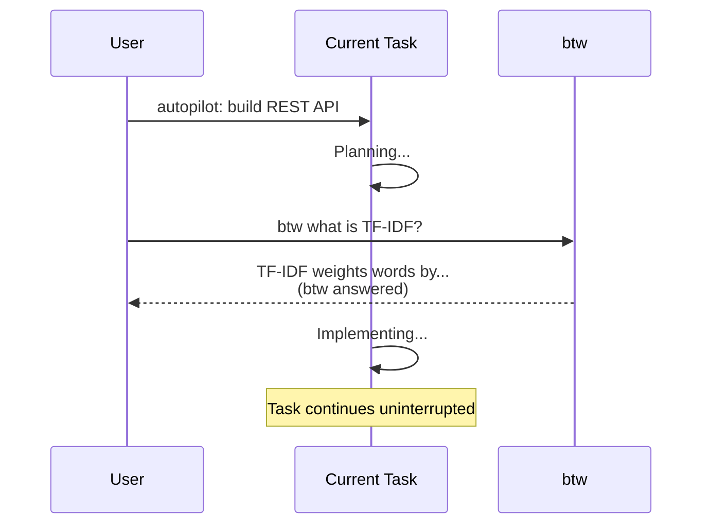

# btw

Quick side-question without derailing the current task.

## Synopsis

```bash
copilot -i "btw what is TF-IDF?"
copilot -i "btw was ist der Unterschied zwischen merge und rebase?"
copilot -i "nebenbei, what's a Copilot Extension vs a Plugin?"
```

## Description

`btw` answers a quick question in max 5 sentences, then returns to your current task. No tools are used — answers come from the model's knowledge only. The response ends with `(btw answered — continuing with your task)`.

Think of it as a side-channel — ask something without losing your place.



## Trigger Keywords

`btw`, `by the way`, `quick question`, `nebenbei`, `kurze Frage`

## Example

```bash
copilot -i "btw what is the difference between vitest and jest?"
```

**Expected output:**
```
Vitest is built on Vite with native ESM support — no transpilation
overhead, near-instant startup. Jest uses a custom transform pipeline
and is slower for TypeScript/ESM projects. Both have nearly identical
APIs, so most Jest tests run in Vitest with minimal changes.

(btw answered — continuing with your task)
```

### Multi-language

```bash
copilot -i "btw was ist TF-IDF?"
```

```
TF-IDF (Term Frequency–Inverse Document Frequency) gewichtet Wörter
nach Häufigkeit im Dokument vs. Seltenheit im Gesamtkorpus.

(btw beantwortet — weiter mit deiner Aufgabe)
```

### Mid-task (the real use case)

```bash
copilot -i "Plan how to add a health check. btw what's the difference between liveness and readiness probes?"
```

The agent answers the btw question first, then continues with the plan — and may even incorporate the btw answer into the plan.

## Quality Contract

- Max 5 sentences
- No tools used (pure knowledge)
- No task derailment
- Responds in user's language
- Ends with "(btw answered — continuing)"

## Rules

- DO: answer briefly and return to task
- DON'T: use view, bash, edit, or any tools
- DON'T: reference the btw question in later responses

## Related

- `omg:explore` — for questions that need codebase search
- `external-context` — for questions that need official docs
- `help` — for "what can omg do?" questions

## See Also

- [All skills](../readme.md)
- [Examples](../../EXAMPLES.md)
